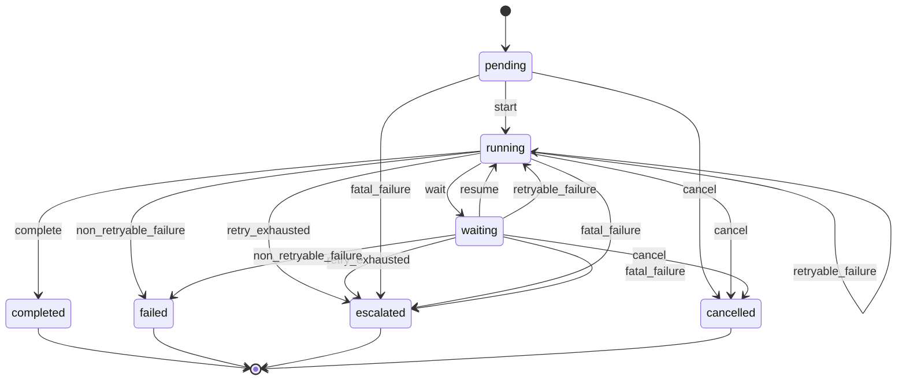
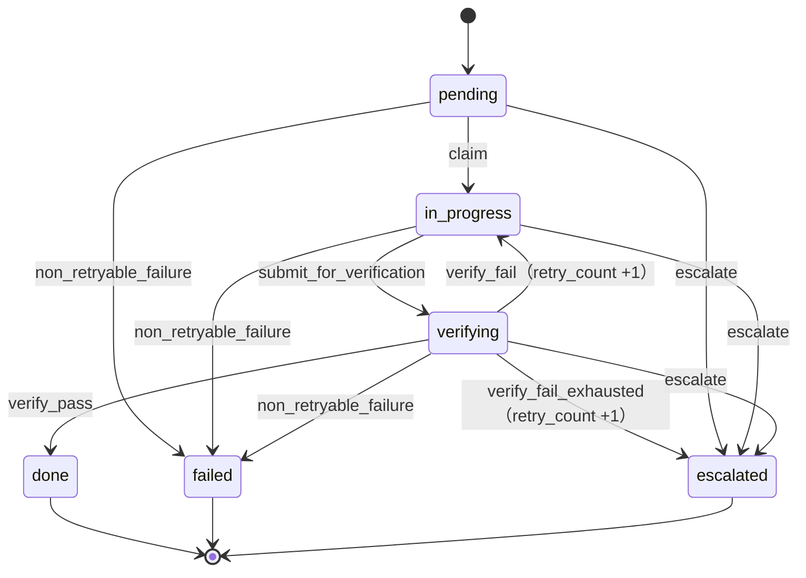

# 状態機械設計書 v0.1（基本設計増補 — 状態機械）

> status: **draft（再降下中）**（2026-08-01 全層再降下 §6 — AI 起草）
> 正準参照: 遷移表（許可される (entity, 現状態, イベント, ガード, 次状態) の全組合せ）の正準は
> [json/s0/transitions.json](../../../L3-system-requirements/canonical/schemas/s0/transitions.json) ＋
> [s0-contract_v0.1.md §3](../../../L3-system-requirements/canonical/s0-contract_v0.1.md)（§3.3 = 強制終了からの再開規則）。
> 本書は遷移表を再掲しない — 状態図・ガード分類・発火権限・競合制御・終端処理の設計だけを確定する。
> 上位設計: [basic-design_v0.1.md](../basic-design_v0.1.md)（CMP-01/02）／
> [detailed-design_v0.1.md](../../../L5-detailed-design/canonical/detailed-design_v0.1.md)（DU-01/02）
> 対応要求: FR-11〜13・NFR-3・NFR-5・BR-I7・AC-SR-02/03

---

## 1. entity 別の状態図

状態機械は 2 entity（`loop_runs`・`tasks`）。loop_runs は 3 種（upper / lower / micro）が
**同一の遷移表を共有**し、差は start ガードと retry 境界のみ（§1.2）。図はイベント名のみを示す —
ガード全文は正準（transitions.json）を参照。

### 1.1 loop_runs（upper / lower / micro 共通形）

### 1.2 loop_kind 3 種の差分（構造は共通・ガードのみ差）

| 観点 | upper | lower | micro |
|---|---|---|---|
| 親 | なし（parent_loop_run_id IS NULL） | 上位 run 必須 | 下位 run ＋親 task 必須 |
| start ガード | brand plan 存在 | 親 running ＋ sprint KPI target ＋ **有効 strategic_brief**（active・digest 一致・有効期間内） | 親 task が in_progress |
| retry 境界 | `config.retry_limit` | 同左 | **親 task の検証 retry と同一境界**（独自加算禁止） |
| 終端の追加契約 | なし | **TLP を同一 tx で INSERT**（§6） | なし |

### 1.3 tasks

tasks に waiting は存在しない — 承認 pending 等の待機は**親 loop_run を waiting** にして表現する
（基本設計 CMP-11）。

## 2. ガードの分類と評価順序

DU-01 `transition()` は guard を event ごとの純関数として登録制で持つ。guard を以下の 6 分類に
正規化し、**固定の評価順序**で判定する。順序の原理: (1) 安価で決定的な検査を先に、(2) 権限の
ない要求には内部状態の情報を返さない、(3) どの段で落ちても状態・retry_count・証跡は不変で
`state_transitions` に guard_result = rejected を記録する（fail-close）。

| 順 | 分類 | 内容 | 主な該当イベント |
|---|---|---|---|
| G0 | 遷移表照合 | (entity, from, event) が正準の表に存在するか。終端状態からの要求は常に拒否 | 全イベント（guard 評価前） |
| G1 | 権限ガード | 発火元が §3 の許可主体か。claim は author agent の execution のみ、verify_* は author と**別 principal** の verifier のみ、cancel は人間のみ | claim / verify_pass / verify_fail / cancel |
| G2 | 構造ガード | 親の状態（parent running・親 task in_progress）、FK 実在、入力・workflow の有効性、lease と row_version の整合 | start / claim / submit_for_verification |
| G3 | brief ガード | lower の start に限り、有効 strategic_brief（status = active・digest 一致・有効期間内）の保持を検査。欠落・失効・digest 不一致は開始拒否（AC-SR-02） | start（lower） |
| G4 | リトライ上限 | retry_count と `config.retry_limit`／`config.approval_retry_limit` の境界判定。境界超過はイベント自体を retry_exhausted / verify_fail_exhausted に切替える | retryable_failure / verify_fail / retry_exhausted |
| G5 | 証跡完備・承認 | 必須証跡 kind の全存在＋kind 別規則の再検証（CMP-03 FN-208）、pair 成立、承認 binding 3 項目の完全一致 | complete / verify_pass / resume |

補足:

- retry_count を増加できるのは `verify_fail`（G4 通過時）のみ。通信再送は同一 idempotency key の
  無消費再送であり retry を消費しない（s0-contract §3.2）。
- 失敗イベントの選択（retryable / non_retryable / fatal / escalate）は guard ではなく、失敗を
  検出した層の**エラー分類境界**（RetryableError / FatalError / GateRejected — 基本設計 §4）が
  事由コードから決定し `failure_code` に記録する。kernel は選択されたイベントを表照合するだけ。

## 3. イベント発火元の一覧（最小権限）

イベントを発火できる主体を固定する。表にない主体からの発火要求は G1 で拒否する。
コネクタ（CMP-08〜11）は**イベントを直接発火できない** — 例外を 3 系エラーに正規化して kernel に
返すのみ（基本設計 §1.3）。

| イベント | entity | 発火できる主体 | 根拠 |
|---|---|---|---|
| start | loop_runs | CMP-02 オーケストレータ（upper は CLI 起動／スケジューラ経由） | ループ進行の一点化 |
| wait / resume | loop_runs | CMP-02（承認 pending・外部待ちの検知時。CMP-11 の応答は CMP-02 経由で反映） | コネクタの状態直書き禁止 |
| complete | loop_runs | CMP-02（CMP-03 の証跡完備・ゲート PASS 判定後） | fail-close の一元化 |
| retryable_failure / retry_exhausted / non_retryable_failure / fatal_failure | loop_runs | CMP-02（エラー分類境界の出力を還元） | 分類は検出層・発火は kernel |
| cancel | loop_runs | **人間のみ**（CLI 明示操作。外部書込み未実行又は補償済みが条件） | 人間専用イベント |
| claim | tasks | **author agent に属する execution のみ**（lease 失効後の再 claim も同様） | s0-contract §1 lease 契約 |
| submit_for_verification | tasks | author 側 execution（lease 保持中） | 出力の帰属明確化 |
| verify_pass / verify_fail / verify_fail_exhausted | tasks | verifier agent（author と別 principal）のみ | 自己審査禁止（principal 単位） |
| non_retryable_failure | tasks | CMP-02（分類境界経由）＋ CMP-03（ゲート赤の還元） | 同上 |
| escalate | tasks | CMP-02／CMP-03（credential 再投入・設計判断等の検出時） | 人の関与要否の判定は検出層 |

## 4. 競合制御（同時イベントの直列化）

前提: 単一プロセス・kernel 単一 writer（BR-I7）。それでも複数 execution・再入・プロセス外接続に
備えて以下を設計とする。

1. **遷移 tx の直列化**: DU-01 の遷移 transaction は `BEGIN IMMEDIATE` で開始し、書込みロックを
   先取する。guard 評価→状態更新→遷移ログが同一ロック区間に入り、check-then-act の競合を消す。
   WAL ＋ `busy_timeout`（config 値）で待機し、超過は retryable_failure に正規化する。
2. **tasks の楽観ロック**: lease・heartbeat の更新は `row_version` 一致を UPDATE 条件に含め、
   不一致（他 execution が先行）は 0 行更新 → GateRejected として拒否する。
3. **lease による claim 排他**: `lease_owner_execution_id`・`lease_expires_at`・`heartbeat_at` が正本。
   プロセス内メモリのみの lease は禁止。失効前の他 execution からの claim は G1/G2 で拒否する。
4. **同一イベントの二重発火**: 遷移が先行コミット済みなら from 状態が変わっており G0 で拒否される
   （拒否も rejected 記録）。よって二重発火は事故にならず証跡に残る。
5. **強制終了・再開**: 再開規則の正準は s0-contract §3.3。設計上の責務分担 — 再開時の
   `external_operations` 照合（prepared/sent/confirmed の分岐）は CMP-02 WF 実行器が行い、
   sent 照合不能は unknown 化して再送せず escalate（最危険 kill point の再送禁止 — 同 §8）。

## 5. 強制終了と再開の設計責務

| 局面 | 責務 CMP | 設計要点 |
|---|---|---|
| 起動時スキャン | CMP-02 | 非終端 run/task を列挙し、§3.3 の表に従い再開分岐。推測（「成功したはず」）による遷移は禁止 |
| lease 失効判定 | CMP-01（G2） | Clock 注入で判定（直接時刻取得禁止）。失効後の再 claim は author agent の新 execution のみ |
| in-flight 外部操作 | CMP-02 ＋ CMP-10 | status 先照合 → 同一 idempotency key 再送（prepared）／リモート照合（sent）／証跡補完のみ（confirmed） |
| waiting の再照合 | CMP-02 ＋ CMP-11 | 承認は binding subject/operation/at の完全一致のみ有効。再照合で充足なら resume |
| 破損検出 | DU-11 verify() | TLP 孤児・FK 違反は自動修復せず escalate（fail-close） |

## 6. 終端処理 — TLP 生成の同一 transaction 契約

下位 run（loop_kind = lower）の終端遷移は、**同一 transaction** に以下を含める（kernel 契約 —
s0-contract §3、AC-SR-03／STC-I-05）:

1. G0〜G5 の guard 判定（terminal イベント）。
2. `loop_runs.state` の終端値への UPDATE。
3. `tactical_learning_packets` の INSERT — completed は `packet_kind = 'learning'`、
   failed / escalated / cancelled は `'failure'`。packet は DU-02 のビルダが run の証跡から構成する。
4. `state_transitions` への遷移ログ INSERT。
5. COMMIT。いずれかが失敗すれば全体 rollback — 「終端したのに packet がない」中間状態を
   DB 上に存在させない。

防御の三重化: (a) 本契約（最低 1 件）、(b) DDL の UNIQUE ＋ integrity トリガ（最大 1 件・
lower/終端/digest 三者一致）、(c) DU-11 `verify()`／LP-OPS の孤児検査（すり抜けの事後検出 →
escalate）。upper / micro の終端に TLP は生成しない（下流→上流の還流は lower のみ）。
