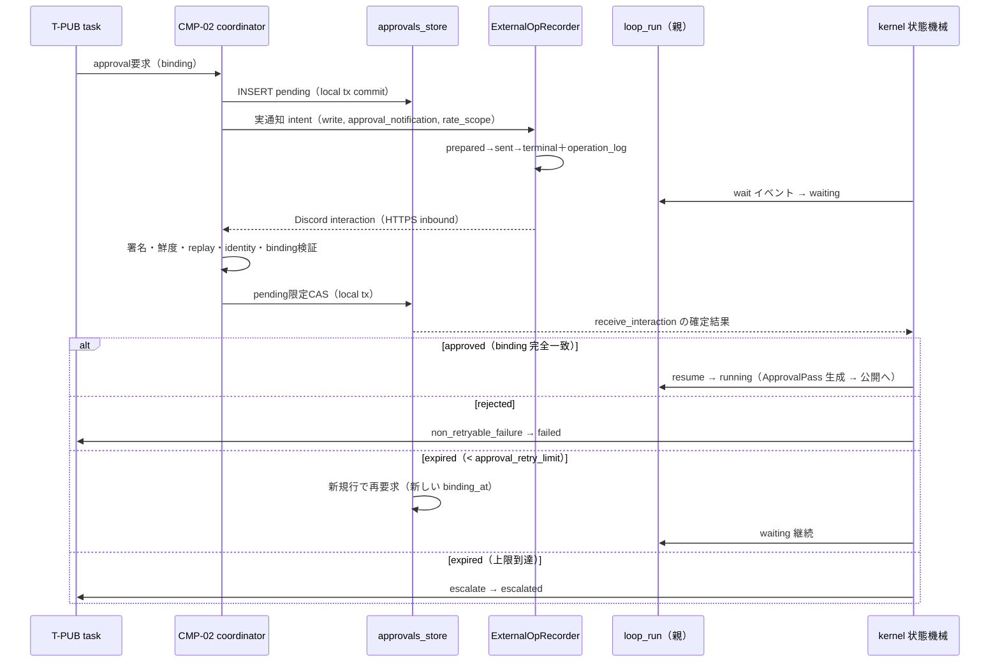

# 機能設計: 承認（approvals 行・遷移ガード接続・束縛承認の実装）

> status: **confirmed**（2026-08-01 全層再降下 §7 — AI 起草）
> 上位設計: [approval-design_v0.1.md](../../L4-basic-design/canonical/approval/approval-design_v0.1.md)（承認設計正本 — decision→分類写像・オートモード基準は同書 §3/§5。本書は再掲しない）
> 正準参照: 要求 = BR-C4/H1/H2（[br-contracts.json](../../L1-business-requirements/canonical/br/br-contracts.json)）・FR-26/46。
> スキーマ・遷移 = [s0-contract_v0.1.md](../../L3-system-requirements/canonical/s0-contract_v0.1.md) §2（approvals DDL）・§2.1（approval evidence 型）・§3（遷移ガード）・§4.2（WF-WP-2 ステップ 3 — DDL 再掲禁止）。
> 兄弟文書: [external-operations.md](external-operations.md)（承認後の外部操作）／[error-taxonomy_v0.1.md](../../L5-detailed-design/canonical/errors/error-taxonomy_v0.1.md)
> 位置づけ: 束縛承認を「approvals 行 ↔ 状態機械ガード ↔ evidence」の実装接続まで降下させる。

---

## §0 位置づけ・動機

外部公開・金銭操作は、対象（binding_subject）・操作（binding_operation）・時点（binding_at）を
明記した承認が証跡化されるまで進まない。実装上の要点は 3 つ: (a) approvals 行の decision が
状態機械のどのガード・イベントに**機械的に**接続されるか、(b) rejected／expired の分岐が
遷移表（s0-contract §3.2）のどの行を踏むか、(c) ApprovalPass 型により「承認確認を通らない公開
呼出し」をコードから排除すること。

## §1 責務分離

| 実装単位 | 所属 | 責務 | 失敗方針 |
|---|---|---|---|
| 承認フロー coordinator | `kernel/orchestrator.py`（CMP-02） | CMP-11 `approvals_store` の pending INSERT をローカル tx で commit → 通知 preflight → CMP-02 Recorder → transport の順を所有 | binding／preflight 拒否は transport 未呼出し・外部 2 表 0 行 |
| `request_approval(intent)` | `connectors/approval.py`（DU-18・CMP-11） | 通知の `ConnectorIntent(effect=write, policy_category=approval_notification, rate_scope)` と request/result 材料だけを返す。approvals／external_operations／evidence を書かない | transport 例外を ConnectorError 材料へ正規化 |
| `approvals_store` | 同モジュール内ストア副層 | CMP-02 から呼ばれる approvals 生 SQL の唯一の置き場（INSERT・decision UPDATE・照合 SELECT）。transport I/O を tx に含めない | decision の削除 API を持たず、再要求は新規行 |
| `receive_interaction(raw_body, signature, timestamp)` | DU-18 | Discord署名・鮮度・replay・application/guild/channel/user・approval ID・binding・expiryを照合し、pending限定CASで応答を確定 | 不一致応答は無効（waiting 継続）。inbound／mock／fixture／dry-run は外部行 0 |
| `verify_approval(...) -> ApprovalPass` | `gates/`（CMP-03 — DU-05 と同じ独占生成パターン） | decision = approved ＋ binding 完全一致の照合を通過した場合のみ ApprovalPass を生成 | 生成失敗 = ApprovalRequired／ApprovalBindingMismatch |
| 金銭操作判定 | `gates/monetary.py`（FN-207 — S3 だが判定表は S0 から固定値） | task の操作型を金銭型定義リストと照合。判定不能は金銭型扱い（fail-close） | 該当時はオートモード判定より先に承認要求 |
| 遷移ガード接続 | `kernel/state.py`（DU-01）・`kernel/orchestrator.py`（DU-02） | decision → 状態機械イベントの発火（§3） | 写像外の decision 値は未定義遷移として拒否 |
| approval evidence 記録 | `evidence/store.py`（DU-09） | kind = approval の型契約検証つき INSERT・approvals.evidence_id との相互整合 | 必須キー欠落・decision ≠ approved は INSERT 拒否 |

- CMP-11 は approvals ストアと transport の request/result 材料だけを所有する。
  `external_operations` の INSERT／status 更新は CMP-02 `ExternalOpRecorder`、operation_log INSERT は
  Recorder から呼ばれる CMP-04／DU-09 が所有する。この境界を越える SQL を connector に置かない。

## §2 approvals 行と遷移ガードの接続

- **pending = 親 loop_run が waiting**（tasks に waiting 状態はない — s0-contract §3.2）。
  待機の正本は approvals.decision であり、kernel はポーリング／再開時に decision を読んで
  イベントを決める。プロセス内タイマーだけの待機状態を持たない。
- **decision → イベント写像は承認設計 §3 が正準**。実装は写像を dict 定数（decision ×
  文脈 → イベント）として `kernel/orchestrator.py` に置き、if 分岐の散在を禁止する。
- 遷移は通常どおり 1 遷移 1 transaction・rejected も state_transitions に記録（DU-01）。
- route／credential／endpoint／cap・`(approval_notification, discord_app, approval_request, target_endpoint)` exact policy の
  通知 preflight、又は ApprovalPass 不在・binding 不一致による
  後続業務操作の拒否は Recorder の prepare より前に行う。当該実 request は
  external_operations／operation_log 0 行で、秘匿化済み process logger だけに理由を残す。

## §3 rejected／expired 分岐の実装

| 分岐 | 実装 |
|---|---|
| **rejected → non_retryable_failure → failed** | decision = rejected の確認時、kernel は task へ `non_retryable_failure` を発火（failure_code = ApprovalRejected）。**escalate ではない**（局所失敗 — 代替 task 発行可）。後続業務 write と inbound interaction の external_operations／operation_log は 0 件のまま（AC-26-2） |
| **expired → 再要求待機** | decision = expired の確認時、同じ subject/operation と**新しい binding_at**の approvals 行を INSERT して waiting を継続（failed にしない）。再要求回数は当該 task × binding subject/operation の expired 行数で数える — **カウンタ列を持たず行数が正本** |
| **approval_retry_limit 到達 → escalated** | 再要求発行前に行数を検査し、`config.approval_retry_limit` 到達なら再要求せず `escalate`（failure_code = ApprovalRetryExhausted）で escalated（AC-26-3 — 無限待機しない）。limit は config 行（ハードコード禁止） |
| **pending のままクラッシュ** | 再開時（s0-contract §3.3 waiting 行）は approvals.decision から復元: pending = 待機継続（**二重要求を作らない** — UNIQUE(task_id, binding_subject, binding_operation, binding_at) が既存行照合を保証）、approved = evidence 整合確認後に公開へ、rejected/expired = 上記写像を適用（AC-46-3） |
| **binding 不一致応答** | ApprovalBindingMismatch — 応答無効・decision 不変・waiting 継続。後続業務 write は外部行 0。1 項目でも不一致なら通らない（AC-46-2）。binding_at と実公開時点の乖離も不一致（FR-46 boundary） |

## §4 束縛承認の evidence 束縛

1. **approved 時のみ** evidence（kind = approval）を INSERT する。payload 必須キー
   （approval_id・decision・binding 3 項目）と decision = approved の検証は DU-09 の kind 型
   契約（s0-contract §2.1）が INSERT 前に強制する。
2. **相互整合**: evidence INSERT → `approvals.evidence_id` UPDATE を同一 transaction で行い、
   `approvals.evidence_id` ↔ `evidence.payload_json.approval_id` の相互参照を成立させる。
   片方だけの行を残さない。
3. **公開実行時の型強制**: 公開（publish_content）が要求するのは approval evidence ではなく、
   approvals 行の binding 3 項目完全一致照合を通過した **ApprovalPass 値オブジェクト**
   （承認設計 §6 — PairPass と同型: `verify_approval` だけが生成でき、コンストラクタ直呼びを
   封じる）。evidence は監査用の証跡、ApprovalPass は実行時のゲート通過証明、と役割を分ける。
4. **done 遷移の再検証**: T-PUB の done は required_evidence_json の approval kind 充足を
   証跡完備ゲート（DU-08・FN-208）が再検証する。承認→公開→done の各段で三重に確認される
   （要求時 binding・公開時 ApprovalPass・完了時 evidence）。
5. **実 transport**: 通知は effect=write＋policy_category=approval_notification＋rate_scope=discord＋
   決定的 idempotency key とし、binding 3 項目確定済みかつ許可済みDiscord Appのexact tupleだけを許可する。
   通知の intent・request payload・result・external row・operation_logを同値にし、送信済み通知には
   `external_operation_row_id` に束縛したoperation_logをちょうど1行残す。Discord interactionはVPSの
   HTTPS endpointでraw body署名・timestamp鮮度・replay nonce・application/guild/channel/user・approval ID・
   binding・expiryを検証し、外部readではないためexternal_operations／operation_logを作らない。
   transport一時失敗やinteraction再送でもdecisionを巻き戻さず、pending限定CASで二重確定を防ぐ。
6. **模擬 transport**: mock／fixture／dry-run で approve/reject/timeout を再現する場合は
   external_operations／operation_log 0 行。予定 fingerprint と模擬結果は秘匿化済み process logger
   だけに残し、provider operation ID を捏造しない。

## §5 金銭操作の常時承認判定

- **判定表**: 金銭操作型定義リスト（価格変更・返金・決済設定に類する型 — 固定値）を
  `gates/monetary.py` の定数タプルとして保持し、task_type／binding_operation を照合する。
  リストの変更は要件改訂（config 化しない — 緩和経路を設けない）。
- **判定順序を型で固定**: 外部書込み系の実行パスは
  `monetary_check → (該当時) verify_approval 必須 → external op` の順で、金銭該当時は
  **オートモード状態の参照より前**に承認要求へ入る（BR-C4「オートモード状態に関わらない」）。
  オートモード判定関数（S1 の FN-410 系）は金銭型 task を入力として受け取らないシグネチャに
  し、バイパス経路をコード構造で塞ぐ。
- **fail-close**: 操作型が判定表に載っていない・分類不能の場合は金銭型として扱い承認を要求する
  （承認設計 §4）。
- **不変条件**: 承認なしの金銭系業務 write は external_operations／operation_log 上 0 件。
  テストは transport 呼出し 0 と両テーブル 0 を assert する（AC-26-1/2）。承認通知／interaction の
  lifecycle と後続の業務 write は policy_category／service／operation で区別する。
  有償 actual write は policy_category=approved_paid_operation、approval_id、
  `spend_ledger.external_operation_row_id` NOT NULL・UNIQUE FK を要し、task/service は一致必須、provider ID は任意。
  無料／手動／非confirmed／mock／dry-run の ledger は 0 行（FR-73）。記帳所有者・terminal tx 参加 API・
  DU／UT は S1 専用 component へ再降下が必要な design debt で、CMP-13／DU-23 や既存 DU-04 には割り当てない。

## §6 テスト方針（test-first）

- 判定純関数（binding 一致・金銭型照合・decision 写像）は fixture のみで検証。
- フロー系の業務判断は in-memory SQLite ＋ mock transport で approve／reject／expired 反復／binding
  不一致／pending クラッシュ再開の 5 系統を⑥の割当 TC どおり赤→実装し、外部 2 表が 0 行と確認する。
  実 transport lifecycle は actual 扱いの loopback transport を用い、write idempotency key、read の
  request_sequence、sent terminal の operation_log exact-1 を別テストで検証する。
- 実通知は policy_category=approval_notification／rate_scope／exact Discord App tuple を assert し、
  category／rate_scope／config 欠落、wildcard、Notion／WP endpoint への入替えは prepare 前に拒否して外部 2 表 0 行とする。
- 「行数 = 再要求カウンタ」の正しさは、再起動を挟んだ expired 反復（transaction を切って
  再開関数を呼ぶ）で limit 到達が正しく検出されることを assert する。
- S0 は常時束縛承認＋mock transport まで（オートモード判定は S1 以降 — 承認設計 §7）。

## §7 trace 表

| 実装単位 | DU | AC | TCC | 備考 |
|---|---|---|---|---|
| request_approval・pending 待機・approved 束縛公開 | DU-18・DU-02 | AC-46-1 | TCC-46-1 | approval_notification exact tuple／rate_scope、waiting は親 loop_run 側 |
| binding 不一致拒否・rejected → failed | DU-18・DU-01 | AC-46-2 | TCC-46-2 | ApprovalBindingMismatch／ApprovalRejected |
| expired 再要求・limit 到達 escalated・pending 再開 | DU-18・DU-02 | AC-46-3 | TCC-46-3 | 行数正本のカウント・二重要求なし |
| 金銭操作の常時承認（オートモード非バイパス） | DU-18＋gates/monetary（FN-207 — S3 で DU 採番） | AC-26-1 | TCC-26-1 | monetary_check が先 |
| 金銭 rejected の failed 分類 | DU-01 | AC-26-2 | TCC-26-2 | non_retryable_failure・送信 0 回 |
| 金銭 expired の limit 到達 escalate | DU-02 | AC-26-3 | TCC-26-3 | approval_retry_limit = config |
| approval evidence の型契約・相互整合 | DU-09 | AC-46-1（evidence 面） | TCC-46-1 | kind = approval の必須キー検証 |

## 8. 実装単位（implementation_units）

責務は DU の **API 1 本**へ接続する。API・AC・TC・UT の対応の機械可読な正本は
[implementation-units.json](implementation-units.json)（`G-L6-IMPLEMENTATION-TRACE` が
DU／API の実在・pre/post への責務の明記・AC／TC／UT の実在と対応を fail-close 検査する）。

| unit_id | DU | API | 契約節 | 責務 | AC |
|---|---|---|---|---|---|
| IU-APPROVAL-01 | DU-18 | API-DU18-02 | POST-01・POST-02・POST-03・POST-04 | `receive_interaction`: Discord署名・replay・identity・binding・expiry検証、pending限定CAS。inbound外部操作行0 | AC-46-1, AC-46-2 |
| IU-APPROVAL-02 | DU-18 | API-DU18-01 | POST-01・POST-02・POST-04 | `request`: pending local tx後、approval_notification exact tuple／rate_scopeの実通知writeをRecorderへ委譲… | AC-46-1 |
| IU-APPROVAL-03 | DU-18 | API-DU18-03 | POST-01・POST-02・RAISE-01 | `rerequest_on_expired`: 新pending行と各approval_notification再通知を分離… | AC-46-3 |
