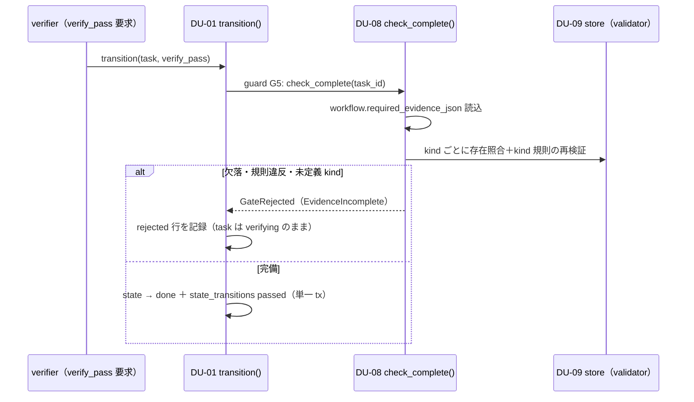

# 機能別詳細設計 — 証跡（evidence）

> status: **confirmed**（2026-08-01 全層再降下 §7 — AI 起草）
> 正準参照: 要求 = FR-28（証跡完備検証）・FR-54（版と証跡）。evidence 型契約（kind 10 種・必須キー・列整合）の正準は
> [s0-contract_v0.1.md §2.1](../../L3-system-requirements/canonical/s0-contract_v0.1.md)、外部操作の順序契約は同 §1（NFR-3）、
> テーブル所有・append-only トリガは [db-design_v0.1.md §2〜3](../../L4-basic-design/canonical/data/db-design_v0.1.md)。
> API 署名の正本は [detailed-design_v0.1.md DU-08/DU-09](../../L5-detailed-design/canonical/detailed-design_v0.1.md)。
> 本書は kind 別必須キー表を再掲しない — 検証器の実装構成と done 遷移・順序規律だけを確定する。

---

## 1. 目的

「証跡がなければ done にならない・証跡は書換えられない・外部操作は証跡化してから状態を進める」の
3 規律を、証跡ストア（DU-09）と完備ゲート（DU-08）の 2 モジュールで実装する。

## 2. 契約（実装が守る事前・事後・不変条件）

- **pre**: INSERT 前に kind 別 validator が payload 必須キー・列整合・追加検証をすべて通過している。
- **post**: evidence 行は task・kind・value で一意に固定され、以後不変（UPDATE/DELETE API は存在せず、
  DB トリガも常時拒否）。
- **invariant**: done 遷移は現 workflow の必須 kind 全存在＋各 kind 規則の**再検証**を通過した場合のみ。
  実外部 read/write の terminal 行は operation_log exactly 1 → 状態遷移の順とし、逆順・
  operation_log の 1:0／1:N／N:1 を作らない。
- 検証オラクル群: TC-EVD-01〜10（A/R 20 件）・TC-SCH-05・TC-GATE-03・AC-28 系（末尾 trace 表）。

## 3. kind 10 種の検証器構成（DU-09）

kind は 10 種（plan_record／commit_hash／review_pass／published_url／measurement／screenshot／
file_hash／approval／operation_log／dashboard — 必須キー・列対応の正準は s0-contract §2.1 の表）。
実装は **kind → validator の登録制ディスパッチ**とし、共通検証 → kind 固有検証の 2 段で行う。

1. **共通検証**（全 kind）: payload の JSON object 性・必須キーの存在と非空・
   credential/secret パターン（DU-14 と共有する正規表現集合、config 拡張可）の不在・
   `UNIQUE(task_id, kind, value)` の事前照合。
2. **kind 固有検証**: 値の意味検査（例: review_pass は `result = PASS` かつ reviewer ≠ author、
   commit_hash は 40/64 桁かつ列と payload の同値、published_url は `assets.canonical_url` との整合に加え、
   `external_operation_row_id` 必須 FK と `operation_log_evidence_id` 必須・UNIQUE self-FK で
   同一 task の confirmed write external row／operation_log 行へ1:1、
   approval は `approvals.evidence_id` との相互整合）。operation_log は
   `external_operation_row_id` 必須で terminal `external_operations.id` 1 行へ束縛し、task・service・
   operation・effect・policy_category・rate_scope・correlation_key・request_hash・request_sequence・result を元行／Recorder result と完全一致させる。
   operation_log payload に rate_scope key を常設し、read は JSON null／外部行 NULL を SQL `IS` 相当で照合する。
   provider external operation ID は operation_log／published_url のどちらでも任意で、
   一致判定や published_url 束縛の主キーにしない。両方にある場合だけ一致を要する。secret・本文は拒否する。
3. 未登録 kind の INSERT 要求・検証器欠落は `GateRejected`（判定不能を通さない）。
   違反時は DB に行を作らない（fail-close — INSERT 前拒否なので rollback も不要）。

`value` は kind 内の安定同一性キーであり、再実行時の重複投入は UNIQUE で既存行に収束する（冪等）。
operation_log の value は内部 `external_operation_row_id` から決定的に生成し、provider ID の
欠落・再利用で別行へ誤束縛しない。
published_url は provider ID を必須キーとせず、URL／asset の整合と
`external_operation_row_id`／`operation_log_evidence_id` で公開成功の内部行と証跡を確定する。

## 4. タスク種別ごとの必須証跡セット

必須 kind の宣言正本は `workflows.required_evidence_json`（DDL）であり、S0 seed の基準は
s0-contract §2.1: **T-PLAN = plan_record／T-PROD = commit_hash／T-REVIEW = review_pass／
T-PUB = published_url・screenshot・approval／T-MEAS = measurement・file_hash・screenshot**。

実装上の要点:

- 完備ゲート（DU-08 `check_complete`）は task の現 workflow から required kind を読み、
  ハードコードしない（workflow 版追加で宣言だけ変えられる）。
- 宣言に**未定義 kind が含まれる場合は判定不能として done を拒否**する（AC-28-3 — 宣言ミスを
  黙って無視して done を許さない）。
- required にない kind の追加証跡は許容する（append-only の追記は自由、完備判定は required のみ）。

## 5. done 遷移の完備検証シーケンス

再検証（INSERT 時に通った規則を done 時にもう一度）を省略しない — 証跡投入後に参照先
（assets・approvals・pair）が変わった場合の不整合を done の直前で検出するため。

## 6. append-only と順序規律（NFR-3）

- **append-only**: evidence への UPDATE/DELETE は DB トリガが常時拒否
  （[db-design_v0.1.md §3.2](../../L4-basic-design/canonical/data/db-design_v0.1.md) の append-only 群）。DU-09 は read/INSERT API のみを公開し、
  訂正は新しい value での追記＋参照側の付替えで表現する（過去の done 判定根拠を消さない）。
- **operation_log 証跡化 → 状態遷移の順**: CMP-02 `ExternalOpRecorder` は実外部 read/write が
  sent へ到達した後、confirmed／provider rejected／unknown の terminal 結果と
  `external_operation_row_id` 束縛 operation_log 1 行を確定し、**その後に**状態遷移を発火する。
  遷移 tx の中に外部 I/O を入れない・証跡未記録のまま状態だけ進める経路を作らない
  （順序は CMP-02／DU-04/DU-02 が固定し、operation_log は状態遷移の記録には使わない）。
- **公開証跡の順序**: content_publish の write を confirmed 化した operation_log 行が先に存在し、
  同一 task の asset 登録後にだけ published_url を INSERT する。
  `published_url.external_operation_row_id` は必須 FK、`operation_log_evidence_id` は NOT NULL・UNIQUE self-FK で
  対応 external row／operation_log へ1:1、
  参照先 operation_log の external row は `effect=write AND policy_category=content_publish AND status=confirmed`、
  task_id も完全一致を要する。provider ID 欠落で拒否しない。
- **双方向 exact-1**: terminal external_operations 各行から operation_log への anti-join と
  GROUP BY、operation_log から external_operations への逆 anti-join を定常検査し、orphan・重複を
  0 件とする。対応行の task・service・operation・effect・policy category・rate scope・correlation key・request hash・request_sequence・result
  mismatch も 0 件でなければならない。in-flight sent は timeout 内だけ許し、timeout 超過は
  reconcile 対象であって証跡を捏造して埋めない。
- **行を作らない経路**: route／credential／endpoint／pair／approval／cap の preflight 拒否と
  mock／fixture／dry-run は external_operations／operation_log とも 0 行。拒否理由・予定
  fingerprint・模擬結果は秘匿化済み process logger にだけ残す。
- 証跡 INSERT は呼出し元 tx に参加できる（例: TLP 生成 tx）が、単独でも意味が完結する行のみ書く。

## 7. trace 表

| 設計要素 | DU | AC | TCC |
|---|---|---|---|
| kind 10 種の型契約検証（受理／拒否） | DU-09 | AC-28-1（ほか kind 別 AC-EVD 系） | TC-EVD-01〜10 A/R, TC-SCH-05 |
| done 遷移の完備検証 | DU-08, DU-01 | AC-28-1, AC-28-2 | TCC-28-1, TCC-28-2, TC-GATE-03 |
| 未定義 kind 宣言の fail-close | DU-08 | AC-28-3 | TCC-28-3 |
| append-only（トリガ＋API 非公開） | DU-09, DU-10 | AC-71-3 | TCC-71-3 |
| terminal operation_log exact-1→状態遷移（NFR-3/5） | DU-02, DU-04, DU-09 | AC-44-1, AC-26-1, AC-905 | TCC-44-1, TCC-26-1, TCC-NFR-05 |
| published_url→confirmed write operation_log 1:1 self-FK | DU-09, DU-17 | AC-44-1 | TCC-44-1 |
| credential 混入拒否 | DU-09, DU-14 | AC-47 系 | TCC-47（TC-047） |

## 8. 実装単位（implementation_units）

責務は DU の **API 1 本**へ接続する。API・AC・TC・UT の対応の機械可読な正本は
[implementation-units.json](implementation-units.json)（`G-L6-IMPLEMENTATION-TRACE` が
DU／API の実在・pre/post への責務の明記・AC／TC／UT の実在と対応を fail-close 検査する）。

| unit_id | DU | API | 契約節 | 責務 | AC |
|---|---|---|---|---|---|
| IU-EVIDENCE-01 | DU-08 | API-DU08-01 | POST-01・RAISE-01・RAISE-02 | `check_complete`・`task`: 現 workflow の required kind 全てが当該 task の… | AC-28-1, AC-28-2, AC-28-3, AC-28-4 |
| IU-EVIDENCE-04 | DU-09 | API-DU09-01 | POST-01・POST-02・RAISE-03 | `record`: operation_logは内部row ID exact-1＋全対応属性一致、published_urlはconfirmed write logへ1:1 self-FK… | AC-47-4, AC-54-1, AC-54-3 |
| IU-EVIDENCE-06 | DU-20 | API-DU20-02 | POST-01・POST-02・PRE-01・RAISE-01 | `link`・`commit_hash`: commit_hash 証跡（kind=commit_hash、value=hash… | AC-54-1, AC-54-3 |
| IU-EVIDENCE-07 | DU-20 | API-DU20-03 | POST-01 | `restore`・`commit_hash`: commit_hash の checkout により審査時と同一内容のソースを… | AC-54-1 |

本文書が担っていた次の責務は、**API 契約節を AC と UT の双方が検証している状態**を作れないため実装単位から外した（接続の穴は[監査記録](../../00-authority/audits/structural-trace-remediation-2026-08-02.md)が正本）。

| 外した unit_id | 理由 |
|---|---|
| IU-EVIDENCE-02 | この API の契約節を AC と UT の双方で検証している節が無い（全節が理由付き N/A） |
| IU-EVIDENCE-03 | この API の契約節を AC と UT の双方で検証している節が無い（全節が理由付き N/A） |
| IU-EVIDENCE-05 | この API の契約節を AC と UT の双方で検証している節が無い（全節が理由付き N/A） |
