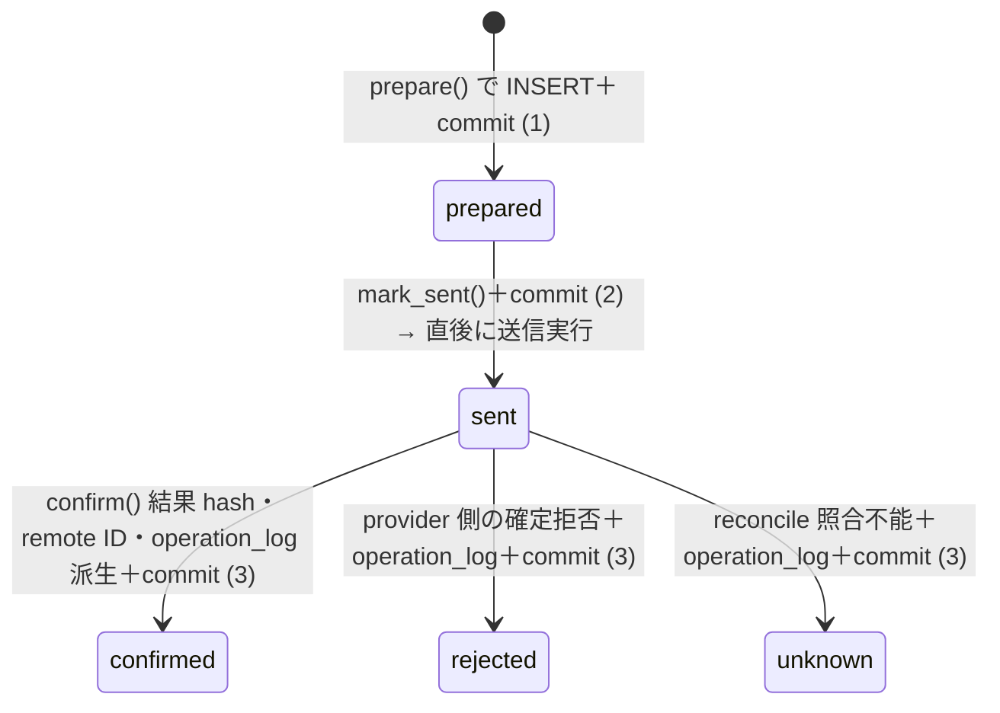

# 機能設計: 外部操作（external_operations ライフサイクル・冪等・レート節度）

> status: **confirmed**（2026-08-01 全層再降下 §7 — AI 起草）
> 上位設計: [external-if-design_v0.1.md](../../L4-basic-design/canonical/external-if/external-if-design_v0.1.md)（コネクタ境界契約 — intent/結果/エラー型・写像表は同書が正本。本書は再掲しない）
> 正準参照: 要求 = BR-I7・BR-F5（[br-contracts.json](../../L1-business-requirements/canonical/br/br-contracts.json)）・FR-41（接続レジストリ）・NFR-3/7。媒体別コネクタ（FR-44/42）は後続スライス。
> スキーマ・遷移 = [s0-contract_v0.1.md](../../L3-system-requirements/canonical/s0-contract_v0.1.md) §1（external_operations 遷移順序）・§3.3（再開規則）・§6（環境契約 — DDL 再掲禁止）。
> 兄弟文書: [error-taxonomy_v0.1.md](../../L5-detailed-design/canonical/errors/error-taxonomy_v0.1.md)／[approval.md](approval.md)
> 位置づけ: 実外部 read/write 1 request の一生
> （prepared→sent→confirmed/rejected/unknown）を、effect・決定的操作キー・再開照合・
> レート節度の実装レベルまで降下させる。

---

## §0 位置づけ・動機

無人運転はクラッシュ・中断・再実行が常態であり（BR-I7 problem）、外部書込みは「二重公開しない」、
外部読取りは「どの論理取得の何回目かを再現できる」、両者は「送信直後に死んでも SQLite だけから
安全に再開できる」ことを request 単位で保証しなければならない。
本書は s0-contract の契約を実装の関数列（preflight・コミット点・kill point・照合手順）に落とす。

## §1 責務分離

| 実装単位 | 所属 | 責務 | 失敗方針 |
|---|---|---|---|
| `ExternalOpRecorder` | `kernel/external_ops.py`（CMP-02） | `external_operations` の INSERT／status 遷移の唯一の書き手。sent 後は CMP-04／DU-09 に operation_log 記録を依頼し、row ID 束縛まで単一 lifecycle として確定 | 遷移順序外の UPDATE・重複証跡・コネクタからの直書きは契約違反（バグ） |
| `make_idempotency_key(...)`／`make_read_key(...)` | 同上（純関数） | write の冪等キーと read の `read:<task_id>:<request_hash>:<request_sequence>` を決定的に生成（§3） | effect と対応キー、read の正整数 request_sequence の欠落は Recorder 呼出し前に拒否 |
| `ExternalPreflight`／`RatePacer` | CMP-02 が DU-05/06/13/14 の検査結果を合成 | route・credential・endpoint・PairPass・ApprovalPass・rate cap、write の exact `(policy_category, service, operation, target_endpoint)` policy、canonical lowercase rate_scope、有償 route の projected spend cap／ledger 必須材料を Recorder の行作成より前に完了（§5／§6） | 拒否は external_operations／operation_log／spend_ledger 0 行、秘匿化済み process logger のみ |
| `reconcile_sent(op)` | `kernel/external_ops.py`（CMP-02） | 再起動時の sent 照合（§4）。terminal 化と operation_log の exact-1 を確定 | write の照合不能は unknown → escalate（再送 0 回）。read 再試行は元行を terminal 化後に request_sequence を増やした別行で発行 |
| 各コネクタ（DU-15〜18・22） | `connectors/*.py` | `ConnectorIntent(effect, policy_category, rate_scope?, request_sequence, ...)` を実行し、request/result 材料と同じ category／rate_scope／sequence の `ConnectorResult` を返す。DB 行・証跡は作らない | 例外は ConnectorError へ境界正規化（外部 IF 設計 §3） |

## §2 ライフサイクル実装（pending 相当 = prepared から）

1 実外部 request = `external_operations` 1 行。read/write は `effect` 以外に別 lifecycle を
作らず、次の関数列で **コミット点を 3 つ**持つ。preflight は行作成より前である。



| 段階 | 実装契約 |
|---|---|
| preflight（行なし） | route／credential／endpoint／PairPass／ApprovalPass／write cap と `effect` 対応キーを全検査。write は required config の exact `(policy_category, service, operation, target_endpoint)` と `rate.<rate_scope>.daily_write_cap` を照合し、category／tuple／rate_scope／config 欠落や wildcard を拒否。read は policy_category=external_read／rate_scope=NULL を検査。不合格は送信 0 回・external_operations／operation_log 0 行で秘匿化済み process logger のみ |
| prepare | preflight 合格済み actual intent だけを Recorder が受理し、execution_mode=actual・effect・policy_category・rate_scope・service・operation・target_endpoint・correlation key・request hash・request_sequence を不変で INSERT（status = prepared）→ **commit**。write は write category・rate_scope・request_sequence=1・idempotency key 必須、read は external_read／rate_scope NULL／idempotency key NULL。この時点で送信 0 回 |
| mark_sent | コネクタへ実 request を委譲する**直前**に status = sent・sent_at を UPDATE → **commit**。送信直後クラッシュの検出窓は「sent かつ terminal 結果未確定」（s0-contract §1） |
| 実 I/O | HTTP／ブラウザ等の read/write を tx 外で実行。timeout は config 宣言値（外部 IF 設計 §4）。コネクタは request/result 材料を返すだけで DB に触れない |
| terminal／operation_log | status=sent のまま Recorder が response_hash・任意の provider operation ID・remote object ID を write-once で設定し、CMP-04／DU-09 経由で confirmed／provider rejected／unknown の result を持つ `external_operation_row_id` 束縛 operation_log を INSERT。同 INSERT trigger が束縛を検証して external row を final 化し **commit**。**task の遷移はこの後**（NFR-3）。approved_paid_operation の ledger 同一 tx 参加は S1 専用 component／API 降下前には実装済みと扱わない |

- prepared→sent を送信前に分けてコミットするのは、クラッシュ位置を SQLite 状態だけで判別する
  ため（prepared = 未送信確定、sent = 送信したかもしれない）。この 2 コミットを 1 つに畳む
  「最適化」は契約違反。
- preflight のローカル拒否と provider へ到達後の rejected は別概念である。前者を
  prepared→rejected 行で表さない。後者は sent へ到達した実 request であり operation_log 必須。
- 下書き作成と公開は**別 idempotency key の別行**（AC-44-1）。1 行に複数 request を混載しない。
  Notion の read 1 要求と分割 write 各要求もそれぞれ 1 行とする。
- **policy category**: read は `external_read` だけ。write の `content_publish` は
  `service=wp` の Docker WP だけ、`review_sync` は `service=notion` かつ明示 config／
  binding 完全一致の ApprovalPass 必須、`approval_notification` は
  `service=claude_code_app, operation=approval_request` かつ確定済み binding の承認通知、`approved_paid_operation` は
  PO 承認済み有償 route に限る。別 category の service／operation／target_endpoint を使用しない。
- content_publish の公開成功は、confirmed write の operation_log を先に確定した後、
  asset 登録を行い、必須の `external_operation_row_id` と `operation_log_evidence_id`
  NOT NULL・UNIQUE self-FK で同一 task の external row／operation_log に 1:1 束縛した published_url evidence を作る。provider operation ID は任意で、
  欠落時も内部 evidence ID と external operation row ID の連鎖で確定する。

## §3 write 冪等キー・read correlation key 生成

```python
def make_idempotency_key(task_id, service, operation, step_key, attempt) -> str:
    # 決定的: 同一 task の同一操作の再実行は同一 key
    return sha256_hex(f"{task_id}:{service}:{operation}:{step_key}:{attempt}")[:48]

def make_read_key(task_id, request_hash, request_sequence) -> str:
    # request_sequence は同一 logical poll 内で 1, 2, ... の正整数
    return f"read:{task_id}:{request_hash}:{request_sequence}"
```

- **決定性**: どちらの key にも乱数・時刻を含めない。write は同一 task・同一操作 attempt の再実行で
  同一 idempotency key を得る。read は同一 logical poll の request hash を固定し、実 request ごとに
  `request_sequence = 1, 2, ...` を割り当てるため、correlation key は必ず
  `read:<task_id>:<request_hash>:<request_sequence>` となる。sequence の時刻由来採番・欠番再利用は禁止。
- **型の降下**: intent・request payload・result・external_operations 行・operation_log payload は
  effect／policy_category／rate_scope／request_sequence を同値で持つ。Recorder は task_id・request_hash・
  request_sequence から read key を再計算し、不一致なら prepare 前に拒否する。
  write は write category と canonical lowercase rate_scope 必須。read は category=external_read、
  intent／result／external row のrate_scopeは NULL、operation_log payload は `rate_scope: null` を常設し
  SQL `IS` 相当で照合する。write では request_sequence を read の再試行識別には使わない。
- **UNIQUE 検出**: 同一 key の再 INSERT は `idempotency_key` UNIQUE で既存行に照合され、
  実装は例外を握って既存行の status に応じた §4 の分岐へ入る（AC-44-3 — 二重公開なし）。
- **列契約**: write は `idempotency_key` 必須かつ `correlation_key = idempotency_key`。
  read は `idempotency_key IS NULL` かつ correlation_key を上記 exact read key とする。
  write の `request_sequence` は 1 に固定し、read は正整数の反復回 1, 2, ... を使う。
- **key 非対応サービス**: WP は idempotency key を決定的 meta key（`_helix_idem_<key>`）として
  下書き・投稿へ保存し、送信前に同 meta の事前照合（既存 = 送信スキップ・confirmed 化）を行う
  （s0-contract §3.3）。照合手段が全滅なら fail-close。

## §4 sent 照合による再開（reconcile_sent）

再起動時（DU-02 の §3.3 再開規則から呼出し）、in-flight 行を status で分岐する:

| status | 照合手順 | 帰結 |
|---|---|---|
| prepared | 未送信確定。effect 対応 key と preflight 合格証明を再検証 | 同一行を mark_sent → 初送（新行を作らない） |
| sent / write | provider operation ID（任意）・remote object ID・idempotency key（WP meta／slug）の利用可能なもので照合 | 成功確認 → confirmed、provider の明示拒否 → rejected、照合不能 → unknown。どの終端も row ID 束縛 operation_log を 1 行作り、unknown は再送せず escalate |
| sent / read | provider operation ID があれば照合し、なければ response／timeout 材料で元 request を terminal 化 | confirmed／rejected／unknown の各行に operation_log を 1 行。再取得は元行確定後、同じ task_id・logical request_hash と次の request_sequence の新行で明示発行 |
| confirmed／rejected／unknown | 終端。`external_operation_row_id` の operation_log exact-1 と service・operation・effect・policy_category・rate_scope・request hash・request_sequence・result の同値を照合 | 正常なら追記しない。欠落／重複／orphan は自動補完で隠さず整合性違反として escalate |

- 照合の実 provider read も effect=read の別 request として Recorder に記録し、同一 poll 内で
  request_sequence を増分する。照合のために write を試さない。
- 「成功したはず」という推測・プロセス内メモリの残骸を再開根拠にしない（s0-contract §3.3）。
- mock／fixture／dry-run は照合自体を含め external_operations／operation_log 0 行。
  lifecycle 分岐は「実 I/O として扱う」と明示した制御可能な loopback transport でテストし、
  単なる mock mode と混同しない（AC-42-3・AC-44-3）。

## §5 レート節度の実装（一様 1〜5 秒・seed 記録）

正準は外部 IF 設計 §7（NFR-7・BR-F5）。実装契約:

```python
class RatePacer:
    def __init__(self, rng: Rng, clock: Clock, config: ConfigStore): ...
    def before_write(self, service: str, rate_scope: str) -> None:
        # 1) UTC 半開区間の日次 cap 検査＋次送信枠予約（CMP-02 single writer）
        # 2) バースト検査（wp: burst_per_min）→ 超過は待機
        # 3) interval = rng.randint(config.rate_interval_min_sec,
        #                           config.rate_interval_max_sec)  # 整数・両端包含
        # 4) 秘匿化済み process log:
        #    {algorithm: "MT19937", seed, interval, service, rate_scope} を 100% 記録
        # 5) clock.sleep(interval)
```

- **対象は書込み・公開系のみ**。読取り系は Pacer を通さない（NFR-7 固定 — fetch_metrics 等は
  通常速度）。
- **Rng/Clock 注入**: Python `random.Random(seed)`（MT19937）の
  `randint(min_sec, max_sec)` を使用し、整数の両端を包含する。seed・algorithm ID・生成値は
  秘匿化済み process logger へ 100% 記録し、テストは seed 固定で間隔列を再現する
  （AC-42-1 — 決定性）。`time.sleep` 直呼びは禁止（Clock 経由 — テストで
  仮想時間化）。固定間隔（分散 0）は機械署名として禁止のため、min == max の config は起動時
  検証で拒否する。
- **cap の消費数**: canonical lowercase rate_scope ごとに、UTC の
  `day_start <= sent_at < next_day_start`（半開区間）にある同 rate_scope の
  `effect='write'` 行を status を問わず数える。confirmed だけでなく sent／rejected／unknown も
  実送信枠を消費し、read・mock・dry-run は除外する。日付境界の `BETWEEN` は禁止する。
- **並行超過の防止**: CMP-02 の単一 writer キューと `BEGIN IMMEDIATE` 相当の境界で、
  上記 COUNT と未送信 prepared 予約の照合 → 次 prepared 行による送信枠予約を直列化する。
  1 予約が sent 又は再開照合で確定するまで同じ rate_scope の次予約を発行せず、複数 worker が同じ残枠を
  見て cap を超えないようにする。再起動時も prepared 行を予約として復元し、メモリカウンタを正本にしない。
- **拒否**: cap 到達・cap 欠落・間隔範囲違反は Recorder の prepare より前に RateLimitExceeded
  とし、external_operations／operation_log 0 行、秘匿化済み process logger のみ。到達後の公開系は
  翌日まで waiting（loop_run の wait イベント）とする（AC-42-2）。
- 値はすべて config 行（`config.rate_interval_min_sec`／`max_sec`／`rate.<rate_scope>.daily_write_cap`／
  `rate.wp.burst_per_min`）。ハードコード禁止・変更は config INSERT のみ。

### §5.1 approved_paid_operation と spend_ledger（S1 design debt）

- **対象**: 検証済み Route が有償で、`execution_mode=actual AND effect=write AND policy_category=approved_paid_operation` の request が
  confirmed になった場合だけ記帳する。無料 route・人手実行・read・provider rejected／unknown・
  preflight 拒否・mock／fixture／dry-run は spend_ledger 0 行。
- **内部 row ID が正本**: `spend_ledger.external_operation_row_id` は NOT NULL・UNIQUE・
  `external_operations.id` FK。provider operation ID は任意で、ledger と external row の両側に
  存在する場合だけ一致を要求する。task_id・service は常に一致必須である。
- **atomicity 契約**: operation_log INSERT trigger による confirmed 化と同じ transaction で
  ledger を INSERT する。ledger 必須材料不備・UNIQUE/FK/一致違反は
  transaction 全体を rollback し、confirmed だけを残さない。sent からの再開照合で confirmed になる
  場合も同じ手順を使い、row ID UNIQUE で二重計上を拒否する。
- **preflight**: 有償 route は ApprovalPass、amount/currency/purpose、月次 projected cap の required
  config を prepare 前に検査する。不備・上限超過は外部 request 0 回、external_operations／
  operation_log／spend_ledger 0 行で、秘匿化済み process logger と正準 state transition だけを残す。
- **整合検査**: ledger→external row の actual/write/approved_paid_operation/confirmed・task/service/provider任意ID一致と、
  検証済み有償 confirmed approved_paid_operation→ledger exactly-1 を双方向検査する。無料／手動 route と
  rejected／unknown の ledger orphan は 0 件でなければならない。
- **実装境界**: S0 では schema／不変条件だけを固定する。記帳の唯一 writer、terminal tx 参加 API、
  DU／UT は S1 専用 component へ再降下する未解消 design debt である。CMP-13／DU-23（計測 ingest）と
  CMP-02／DU-04 の既存 API に記帳責務を追加せず、専用 API／契約節／AC／UT が降下するまで実装 confirmed にしない。

## §6 policy category 別の kill point

外部書込みの最終防波堤は**policy category と送信先の exact policy**（環境契約 = s0-contract §6）:

1. CMP-02 の ExternalPreflight は Recorder の `prepare` より前に required config から
   `(policy_category, service, operation, target_endpoint)` と canonical lowercase rate_scope・
   `rate.<rate_scope>.daily_write_cap` を exact 照合する。category／tuple／rate_scope／config 欠落、
   wildcard、他 category の tuple 利用は `ProductionWriteDenied` — **送信 0 回・
   external_operations／operation_log 0 行**。拒否理由は秘匿化済み process logger にだけ残す。
2. category 別契約は次の通り: `content_publish` は Docker WP の publish／draft／media 操作だけ、
   `review_sync` は明示 config の Notion `sync_result` かつ完全一致 ApprovalPass がある場合だけ、
   `approval_notification` は Claude Code アプリ `approval_request` かつ binding 3 項目確定済みの場合だけ、
   `approved_paid_operation` は PO 承認と有償 route が完全に束縛済みの場合だけ。
   「Docker WP のみ」は `content_publish` のみに適用し、他 category を公開経路にしない。
3. 同じ preflight で route 解決・credential endpoint 照合・CredentialLeak scan・PairPass・
   必要時 ApprovalPass・rate cap・有償時の projected spend cap／ledger 材料を完了する。
   いずれかの拒否も外部 2 表と spend_ledger が 0 行であり、prepared→rejected を作らない。
4. 実 GA4 への**write intent はコード上存在しない**。実 `fetch_metrics` は
   `effect=read`・`policy_category=external_read`・`rate_scope=NULL`・
   request_sequence 付きで Recorder の lifecycle を通り、mock／fixture／dry-run は行 0 とする。
5. dry-run は外部送信せず、予定 request fingerprint と模擬結果を秘匿化済み process logger にだけ
   残す。mock operation ID を捏造せず、テスト・CI の mock mode も external_operations／operation_log 0 行。

## §7 テスト方針（test-first）

- 純関数（make_idempotency_key・make_read_key・request_hash 正準化・MT19937 randint の間隔列）は
  fixture のみで検証。read は同一 poll の request_sequence が 1, 2, ... と増え、exact key 文字列を assert する。
- ライフサイクル・再開は in-memory SQLite ＋「実 I/O 扱い」の loopback transport で、**各コミット点直後の
  プロセス kill を模擬**（transaction を切って再開関数を呼ぶ）する 3 点 kill test を必須とする:
  prepared 直後／sent 直後（WP 成功済み・WP 失敗・照合不能の 3 変種）／confirmed 直後。
- loopback transport の送信回数を assert し、write の拒否系・再開系は送信 0 回又は 1 回（再送なし）、
  read 再試行は各 request_sequence が別行で 1 回ずつであることを確認する。
- preflight 各拒否、mock、fixture、dry-run は external_operations／operation_log がともに 0 行。
  provider rejected／unknown を含む全 sent 行は row ID 束縛 operation_log がちょうど 1 行で、
  orphan・重複・field mismatch が 0 件であることを双方向に検査する。
- policy category は external_read と 4 write category の正常 tuple に加え、category 欠落・未知、
  config 欠落、wildcard、WP→Notion／Notion→Claude Code アプリ等の category 間 endpoint 入替え mutation を
  全て prepare 前に赤にする。policy_category／rate_scope を intent／request／result／external row／
  operation_log のいずれかで改変する mutant、read の rate_scope を非 NULL にする mutant も赤にする。
- cap 境界は UTC 日付切替、rejected／unknown の消費、read 除外、2 worker の同時 1 枠取得 mutation
  を含め、COUNT＋予約の single-writer 直列化を外した mutant が red になることを確認する。
- spend_ledger は S1 専用 component／API／DU／UT が降下するまで implementation unit に割り当てない。
  降下時は confirmed approved_paid_operation＋operation_log／ledger の同一 terminal tx、
  provider ID=NULL でも内部 row ID 1:1、再開時の非二重計上、無料／手動／read／非confirmed の 0 行を
  必須 mutation 契約とし、それら無しで design debt を解消済みにしない。
- published_url は先行する同 task の confirmed content_publish external row／operation_log へ
  `external_operation_row_id`／`operation_log_evidence_id` で 1:1 束縛し、provider ID=NULL でも受理する。self-FK／UNIQUE・
  task 一致・write/confirmed 制約のいずれかを外す mutation は red とする。

## §8 trace 表

| 実装単位 | DU | AC | TCC | 備考 |
|---|---|---|---|---|
| read/write lifecycle 3 コミット・operation_log exact-1 | DU-04（CMP-02 Recorder）・DU-09（evidence store）・各 connector | AC-44-1 | TCC-44-1 | connector は材料のみ、draft/publish は別 key 別行。published_url は publish log へ1:1 self-FK |
| PairPass なし・policy category exact tuple 拒否（kill point） | DU-17・DU-05（require_pair）・DU-14（endpoint 照合） | AC-44-2 | TCC-44-2 | content_publish は Docker WP だけ。拒否は送信 0 回・ProductionWriteDenied |
| sent 照合再開・同一 key 冪等 | DU-02（§3.3 再開）・DU-17 | AC-44-3 | TCC-44-3 | 最危険 kill point で再送 0 回 |
| レート節度（MT19937 randint・seed 再現） | DU-04・DU-15 | AC-42-1 | TCC-42-1 | Rng/Clock 注入・秘匿 process log 100% |
| 媒体禁止・rate_scope 日次 cap 拒否 | DU-04・DU-15 | AC-42-2 | TCC-42-2 | UTC half-open COUNT＋single-writer 予約、拒否は行 0 |
| ブラウザ経路の sent 照合・unknown escalate | DU-15・DU-02 | AC-42-3 | TCC-42-3 | 照合不能 = unknown・escalate |
| 計測取得の read-only 保証 | DU-22・DU-04 | AC-62-1 | TCC-62-1 | effect=read・external_read・rate_scope NULL・request_sequence、実 GA4 write 経路なし |

## 9. 実装単位（implementation_units）

責務は DU の **API 1 本**へ接続する。API・AC・TC・UT の対応の機械可読な正本は
[implementation-units.json](implementation-units.json)（`G-L6-IMPLEMENTATION-TRACE` が
DU／API の実在・pre/post への責務の明記・AC／TC／UT の実在と対応を fail-close 検査する）。

| unit_id | DU | API | 契約節 | 責務 | AC |
|---|---|---|---|---|---|
| IU-EXTERNALOPERATIONS-01 | DU-04 | API-DU04-01 | POST-01・POST-02・RAISE-01 | `load`・`workflows`: definition_json / required_evidence_json を sche… | AC-12-5, AC-12-6 |
| IU-EXTERNALOPERATIONS-02 | DU-04 | API-DU04-02 | POST-02・RAISE-02 | `run_step`: Recorder がcategory/rate_scope付きactual lifecycleとterminal log exact-1を所有。spend ledgerは非所掌… | AC-42-1, AC-42-3 |
| IU-EXTERNALOPERATIONS-04 | DU-13 | API-DU13-01 | POST-01・POST-02・RAISE-01・RAISE-02 | `resolve`: Recorder前preflight。拒否は外部2表0行… | AC-41-1, AC-41-2, AC-41-3 |
| IU-EXTERNALOPERATIONS-05 | DU-14 | API-DU14-02 | POST-01・POST-02・RAISE-01 | `check_endpoint`: exact policy材料。category/rate_scope/policy拒否は外部2表0行… | AC-47-3 |
| IU-EXTERNALOPERATIONS-06 | DU-14 | API-DU14-01 | POST-01・RAISE-01 | `get_credential`: メモリ内Secretのみ。欠落時はprepare前・外部2表0行… | AC-47-1, AC-47-2, AC-47-3 |
| IU-EXTERNALOPERATIONS-07 | DU-14 | API-DU14-04 | POST-01 | `mask`・`text`: config.secret.masking_patterns と本モジュールのパターン集合に一致す… | AC-47-2, AC-47-4 |
| IU-EXTERNALOPERATIONS-08 | DU-14 | API-DU14-03 | POST-01・POST-02 | `scan`: 平文検知はprepare前・外部2表0行… | AC-47-1 |
| IU-EXTERNALOPERATIONS-10 | DU-15 | API-DU15-03 | POST-01・POST-02・POST-04・RAISE-01・RAISE-02・RAISE-04 | `run_playbook`: connectorはeffect/category/rate_scope/sequence付き材料のみ… | AC-42-1, AC-42-2, AC-42-3 |
| IU-EXTERNALOPERATIONS-12 | DU-16 | API-DU16-01 | POST-01 | `get`: 現役routeのactive版だけを返す… | AC-42-1 |
| IU-EXTERNALOPERATIONS-13 | DU-16 | API-DU16-03 | POST-02 | `record_failure`: active→broken CASとCMP-02 repair task編成へ接続… | AC-43-1, AC-43-2 |
| IU-EXTERNALOPERATIONS-14 | DU-16 | API-DU16-02 | POST-01 | `record_success`: active現役版だけを条件付き更新… | AC-42-1 |
| IU-EXTERNALOPERATIONS-15 | DU-17 | API-DU17-01 | POST-01・PRE-02・RAISE-02 | `create_draft`: content_publish/rate_scope/exact Docker policyのwrite材料のみ… | AC-44-1, AC-44-2 |
| IU-EXTERNALOPERATIONS-16 | DU-17 | API-DU17-02 | POST-01・PRE-02・RAISE-02・RAISE-03 | `publish`: content_publish/rate_scopeのwrite材料のみ、全preflight拒否は外部2表0行… | AC-44-1, AC-44-2, AC-44-3 |
| IU-EXTERNALOPERATIONS-17 | DU-17 | API-DU17-04 | POST-01・POST-02 | `register_asset`・`published`: assets 登録後、published_urlをconfirmed publish operation_logへ1:1 self-FK… | AC-44-1 |
| IU-EXTERNALOPERATIONS-18 | DU-17 | API-DU17-03 | POST-02 | `upload_media`: content_publish/rate_scopeのwrite材料のみ、Recorderがterminal log exact-1を所有… | AC-51-3 |
| IU-EXTERNALOPERATIONS-19 | DU-16 | API-DU16-04 | PRE-01・POST-01・POST-02・POST-03・RAISE-01 | `install_repaired_version`: repair task束縛、旧版retired＋新版activeを単一txで確定… | AC-43-1, AC-43-3 |

spend_ledger は本表の既存 DU に割当てない。S1 で専用 component／API／DU／契約節／AC／UT を
同時降下し、それまでは design debt として未 confirmed のまま保持する。CMP-13／DU-23 への偽被覆を禁止する。

本文書が担っていた次の責務は、**API 契約節を AC と UT の双方が検証している状態**を作れないため実装単位から外した（接続の穴は[監査記録](../../00-authority/audits/structural-trace-remediation-2026-08-02.md)が正本）。

| 外した unit_id | 理由 |
|---|---|
| IU-EXTERNALOPERATIONS-03 | この API の契約節を AC と UT の双方で検証している節が無い（全節が理由付き N/A） |
| IU-EXTERNALOPERATIONS-09 | この API の契約節を AC と UT の双方で検証している節が無い（全節が理由付き N/A） |
| IU-EXTERNALOPERATIONS-11 | この API の契約節を AC と UT の双方で検証している節が無い（全節が理由付き N/A） |
