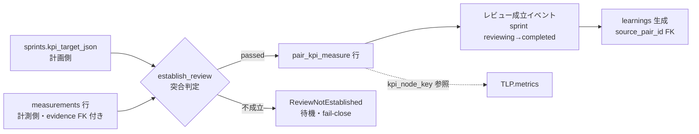

# 機能設計: KPI 交差点（計画↔計測ハンドオフ）

> status: **confirmed**（2026-08-01 全層再降下 §7 — AI 起草）
> 正準参照: 要求 = FR-22（計画↔計測ペア判定）・FR-15（還流）・FR-61/62（KPI ツリー・計測取り込み）・
> SR-12（[sr-contracts.json](../../L3-system-requirements/canonical/strategy/sr-contracts.json) — 観測背骨と戦略正本の分離）。
> スキーマ = [s0-contract_v0.1.md §2](../../L3-system-requirements/canonical/s0-contract_v0.1.md)
> （`pair_kpi_measure`・`kpi_nodes`・`measurements`・`learnings`・`tactical_learning_packets` — DDL 再掲禁止）。
> 上位設計: [basic-design_v0.1.md](../../L4-basic-design/canonical/basic-design_v0.1.md)（CMP-03/13）／
> [strategy-loop-design_v0.1.md](../../L4-basic-design/canonical/components/strategy-loop-design_v0.1.md)（TLP 経路）
> 位置づけ: 「計画（KPI 目標）」と「計測（スナップショット）」が交差する唯一の成立点の実装詳細。

---

## §0 位置づけ・動機

数値を見た気になっただけの「レビューしたつもり」を構造的に禁止する。スプリントの完了は、
計画側の KPI 目標と計測側の取得証跡つきスナップショットが **`pair_kpi_measure` として突合成立**
した場合にのみ発生し、その成立イベントだけが learnings 生成（FR-15）と TLP metrics の起点になる。
同時に、KPI ツリーは**観測背骨であって戦略正本ではない**（SR-12）— 数値から意味正本への自動書込み
経路を実装として持たないことを本書で固定する。

## §1 責務分離

| 実装単位 | 所属 | 責務 | 失敗方針 |
|---|---|---|---|
| `establish_review(scope, sprint_id)` | `gates/kpi_pair.py`（CMP-03・FN-203） | 成立判定の唯一の入口。判定＋`pair_kpi_measure` INSERT＋成立イベント発火を 1 transaction で行う | 不成立は `ReviewNotEstablished`（恒久拒否ではなく待機） |
| `match_targets(kpi_target_json, measurements)` | 同上（純関数） | 目標ノード集合と計測スナップショットの突合（§2.2） | 空目標・期間不整合は不成立（fail-close） |
| `revoke_pair(pair_id, reason)` | 同上 | 計測の取り消し・目標改訂時の status = revoked 化 | revoked 後の learnings 参照は生成側で拒否 |
| 還流処理 | `kernel/orchestrator.py`（DU-02・FN-15x 系） | 成立イベント受領 → learnings 1 行生成（source_pair_id FK・status = draft） | pair 未成立は `PairNotEstablished` で生成しない |
| KPI ノード登録・ツリー解決 | `measure/kpi.py`（DU-21・FN-601） | kpi_nodes の階層検証つき登録。node_key → id 解決を TLP 生成側へ提供 | 有料指標型は DB CHECK＋zero_ad ゲート二重拒否 |
| TLP metrics 充填 | `kernel/orchestrator.py`（DU-02） | 下位 run 終端時、`metrics_json` を **kpi_node_key 参照＋値**で記録（計測の再定義をしない — SR-12） | 未解決 node_key は TLP 生成を拒否（整合トリガと同格の fail-close） |

## §2 成立判定の契約

### §2.1 pair_kpi_measure の成立条件（DbC）

pre（すべて満たす場合のみ INSERT）:

1. sprint.status = `reviewing` である（planned／active での先行成立を許さない）。
2. `sprints.kpi_target_json` が **1 件以上の目標ノード**を宣言している（空 JSON は判定不能 —
   AC-22-3 の fail-close）。目標の形は `{node_key: {target_value, unit}}` を正とする。
3. 目標に含まれる各 node_key が同一プロファイルの `kpi_nodes`（status = active）に解決できる。
4. 各対象ノードに、**sprint 期間と整合**（`period_start >= sprints.starts_at` かつ
   `period_end <= sprints.ends_at`）する `measurements` 行が 1 件以上存在し、その行が
   `evidence_id`（取得証跡）へ FK 接続されている。証跡なしの数値は突合対象にしない。

post: 対象ノードごとに `pair_kpi_measure`（sprint_id, kpi_node_id, measurement_id, status = passed）
を INSERT し、レビュー成立イベント（sprint: reviewing → completed）を同一 transaction で発火する
（AC-22-1）。UNIQUE(sprint_id, kpi_node_id, measurement_id) が重複成立を冪等に吸収する。

invariant: 判定は**達成/未達を問わない** — 目標と実測の両参照が揃うことが成立条件であり、
目標未達でもペアは成立する（未達の解釈は learnings／TLP の領分。判定にビジネス評価を混ぜない）。

### §2.2 突合アルゴリズム（match_targets — 純関数）

1. 目標ノード集合 T を kpi_target_json から抽出（空なら即不成立）。
2. 各 t ∈ T について、期間整合・証跡つきの measurements 候補を新しい period_end 優先で 1 件選ぶ
   （同一期間はより後に imported された行 — 決定的なタイブレーク）。
3. **全ノードに候補が揃った場合のみ**成立（部分成立なし — 1 ノードでも欠ければ
   `ReviewNotEstablished`）。欠落ノード一覧を例外 payload に含め、待機理由を証跡化する。
4. 判定は pure（DB 読取り済みのスナップショット入力 → 判定結果）。Clock は「期間整合」判定に
   使わない（期間は行データのみで閉じる — 再実行で同一判定）。

### §2.3 不成立・再判定・revoke

| 事象 | 分類 | 振る舞い |
|---|---|---|
| 計測 0 件（AC-22-2） | `ReviewNotEstablished` | 成立イベント・learnings・上位還流のいずれも発生しない。sprint は reviewing のまま待機 |
| 空目標 → 後から目標＋計測が揃う（AC-22-3） | 同上 → 再判定で成立 | 不成立は恒久拒否ではない。`establish_review` の再実行のみで成立し得る（判定に隠れ状態なし） |
| 目標改訂・計測取り消し | `revoke_pair` | status = revoked の UPDATE（成立行は削除しない — 履歴保持）。revoked ペアを source とする learnings 生成は拒否 |
| 成立済みペアへの再実行 | 冪等 | UNIQUE 制約で既存行に照合し、差分ゼロ・イベント再発火なし |

## §3 レビュー成立イベント → learnings → TLP metrics

1. **learnings 生成（FR-15）**: 成立イベントを受けた還流処理が learnings 1 行
   （sprint_id・source_pair_id FK・status = draft）を生成する。生成は
   「同一 source_pair_id の既存 learnings 検出 → なければ INSERT」の冪等手順とし、
   クラッシュ後再実行でも重複しない（AC-15-3 — 上位キューは learnings 行を正本に再構成）。
2. **TLP metrics（KPI ノード参照）**: 下位 run 終端時の TLP 生成（DU-02）は、`metrics_json` の
   各要素を `{kpi_node_key, value, ...}` として記録する（schema 正本 =
   [tactical-learning-packet.schema.json](../../L3-system-requirements/canonical/schemas/strategy/tactical-learning-packet.schema.json)）。
   値は measurements から読むだけで、TLP 側に独自の集計・再計算を持ち込まない（計測の重複定義
   禁止 — SR-12 normal_behavior）。
3. **順序**: pair 成立 → learnings は sprint レビューの経路、TLP は loop_run 終端の経路であり、
   両者は kpi_nodes／measurements という同一の観測背骨を**読む**点だけで交差する。片方の失敗が
   他方を巻き戻さない（learnings 生成失敗は sprint 側の retry、TLP は run 終端 transaction 内）。

## §4 観測背骨と戦略正本の分離（SR-12 の実装固定）

- **自動書込み経路の不在**: `measure/*`（CMP-13）・`gates/kpi_pair.py` のどのモジュールも
  `strategic_briefs`／上流モデル群への書込み API を import しない。分離は import 構造＋
  保護トリガ（DDL）＋静的検査（AC-SR-04 の経路検査に相乗り）で三重に保証する。
- **数値変動は戦略変更の根拠にならない**: KPI 急変を検出しても行うのは TLP の `anomalies` 記録と
  `recommended_next_action = request_strategy_review` の還流までであり、brief の改訂は上流改善
  工程（SR-10 の複数根拠 revision）だけが行う。閾値による自動 revision を実装しない。
- **「何が起きたか」と「なぜ起きたか」の分担**: 前者 = kpi_nodes／measurements（観測背骨）、
  後者 = TLP.causal_interpretation と意味モデル。learnings の learning_json にも「なぜ」を書くが、
  それは下流スプリント学習であり上流正本ではない（上流へ届く経路は TLP のみ）。

## §5 実装順・テスト方針

- FN-203（成立判定）はスライス **S1**。S0 は kpi_nodes／measurements／pair_kpi_measure の
  schema と WF-MEAS-1 による計測投入（FN-601〜603 = DU-21〜23）まで。S0.1 では TLP metrics の
  kpi_node_key 参照整合（STC-I-05 の範囲）だけを先に green にする。
- S1 実装時は⑥の割当に従い test-first: 成立（AC-22-1）→ 計測ゼロ不成立（AC-22-2）→
  空目標境界（AC-22-3）→ 還流の生成・拒否・冪等（AC-15-1〜3）の順に赤→実装。
  突合純関数（§2.2）は fixture のみで検証し DB 不要、成立イベント〜learnings は
  in-memory SQLite の transaction 検証とする。

## §6 trace 表

| 実装単位 | DU | AC | TCC | 備考 |
|---|---|---|---|---|
| establish_review・match_targets・pair INSERT | S1 の FN-203 実装 DU（⑤改訂で採番。ペア判定パターンは DU-05 と同型） | AC-22-1 | TCC-22-1 | 成立＋sprint completed＋learnings 起点 |
| 計測ゼロの不成立 | 同上 | AC-22-2 | TCC-22-2 | ReviewNotEstablished・イベント不発火 |
| 空目標 fail-close・再判定成立 | 同上 | AC-22-3 | TCC-22-3 | 不成立 = 待機（恒久拒否ではない） |
| 還流 learnings 生成 | DU-02（orchestrator） | AC-15-1 | TCC-15-1 | source_pair_id FK・status = draft |
| pair 未成立時の還流拒否 | DU-02 | AC-15-2 | TCC-15-2 | PairNotEstablished |
| 還流の冪等再実行 | DU-02 | AC-15-3 | TCC-15-3 | 同一 source_pair_id の重複生成なし |
| KPI ノード登録・ツリー解決 | DU-21 | AC-61-1 | TCC-61-1 | 5 階層接地・非有料指標のみ |
| 計測投入の冪等・証跡 FK | DU-22・DU-23 | AC-62-1 | TCC-62-1 | 観測背骨側の前提 |
| 非有料指標の入口検査（ゼロ広告費ゲート） | DU-07 | AC-23-1 | TCC-23-1 | KPI ツリーへ入る指標種別・ドメインの fail-close 検査（FR-23） |
| TLP metrics の KPI ノード参照・分離 | DU-02・DU-10 | AC-SR-03・AC-SR-04 | STC-I-05・STC-I-06 | SR-12 の実装固定（自動書込み経路の不在） |

## 7. 実装単位（implementation_units）

責務は DU の **API 1 本**へ接続する。API・AC・TC・UT の対応の機械可読な正本は
[implementation-units.json](implementation-units.json)（`G-L6-IMPLEMENTATION-TRACE` が
DU／API の実在・pre/post への責務の明記・AC／TC／UT の実在と対応を fail-close 検査する）。

| unit_id | DU | API | 契約節 | 責務 | AC |
|---|---|---|---|---|---|
| IU-KPIHANDOFF-01 | DU-07 | API-DU07-02 | POST-01・RAISE-01 | `check_domain`・`denylist`: denylist 非該当かつ判定可能な場合のみ返る。denylist/al… | AC-23-1, AC-23-2, AC-23-3 |
| IU-KPIHANDOFF-02 | DU-07 | API-DU07-01 | POST-01・POST-02・RAISE-01 | `check_metric_type`・`metric_type`: deny 型（cac/roas/ad_spend — 有料… | AC-23-1, AC-23-2, AC-23-4 |
| IU-KPIHANDOFF-03 | DU-21 | API-DU21-03 | POST-01 | `archive_node`・`node_id`: status を archived へ更新し、measurements・子ノ… | AC-61-3 |
| IU-KPIHANDOFF-04 | DU-21 | API-DU21-01 | POST-01・POST-02・POST-03・PRE-01・PRE-02・PRE-03・RAISE-01・RAISE-02 | `create_node`・`node`: 階層・媒体タグ・集計式（aggregation_formula の構文検証）を通過し… | AC-61-1, AC-61-2 |
| IU-KPIHANDOFF-06 | DU-22 | API-DU22-01 | POST-01・POST-02 | `fetch`・`route`: 取得物（CSV/xlsx 又は API 応答）を out_dir へ保存し、即 SHA-256… | AC-62-1, AC-62-2 |
| IU-KPIHANDOFF-07 | DU-23 | API-DU23-02 | POST-02・POST-03 | `ingest`・`expected_hash`: 投入前に raw の SHA-256 を再計算し expected_hash… | AC-62-1, AC-62-3, AC-62-4, AC-62-6 |
| IU-KPIHANDOFF-08 | DU-23 | API-DU23-01 | POST-01・POST-02・RAISE-01 | `parse`・`schema`: schema/type 検証を通過した正常行と、壊れた行の隔離ファイル（正常行と分離）を返す… | AC-62-2, AC-62-3 |

本文書が担っていた次の責務は、**API 契約節を AC と UT の双方が検証している状態**を作れないため実装単位から外した（接続の穴は[監査記録](../../00-authority/audits/structural-trace-remediation-2026-08-02.md)が正本）。

| 外した unit_id | 理由 |
|---|---|
| IU-KPIHANDOFF-05 | この API の契約節を AC と UT の双方で検証している節が無い（全節が理由付き N/A） |
