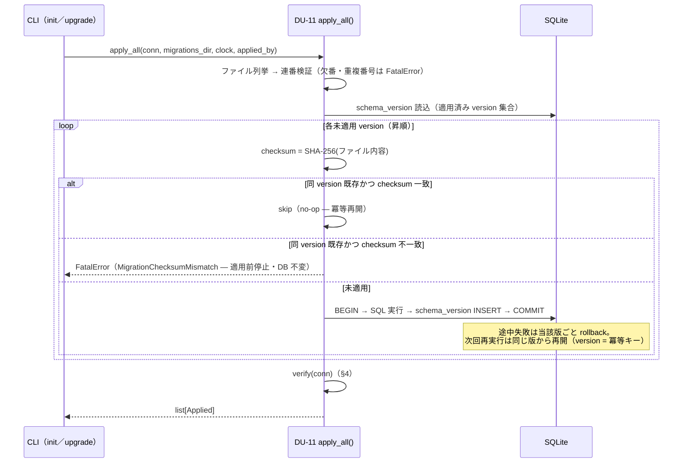

# 機能別詳細設計 — DB マイグレーション

> status: **confirmed**（2026-08-01 全層再降下 §7 — AI 起草）
> 正準参照: 要求 = FR-72（マイグレーション — 前方参照のみの昇格）。migration 規則（expand/backfill/contract・昇格手順）の正準は
> [s0-contract_v0.1.md §5](../../L3-system-requirements/canonical/s0-contract_v0.1.md)、設計判断の上位は
> [db-design_v0.1.md §4・§6](../../L4-basic-design/canonical/data/db-design_v0.1.md)。API 署名の正本は
> [detailed-design_v0.1.md DU-11](../../L5-detailed-design/canonical/detailed-design_v0.1.md)。本書は規則を再掲しない —
> `apply_all`／`verify()` の実装アルゴリズムと失敗時挙動だけを確定する。

---

## 1. 目的

スキーマ変更を「前方参照のみ・1 版 1 transaction・checksum 固定・検証不合格なら使わせない」の
機械的手続きへ落とし、壊れた DB での運転開始と適用済み migration の書換えを構造的に不可能にする。

## 2. 契約（実装が守る事前・事後・不変条件）

- **pre**: `migrations/NNNN_description.sql` は連番・不変。適用前に SHA-256 を計算し、
  `schema_version` の既存行と照合済み。
- **post**: 適用された版ごとに schema_version へ version・migration 名・checksum・適用者・時刻が
  同一 tx で記録される。全適用後 `verify()` が pass。
- **invariant**: 同 version の再適用は no-op（冪等）。checksum 不一致・verify 不合格の DB では
  業務書込みが 1 件も始まらない（fail-close）。rename・意味変更は migration に現れない
  （expand で新名追加のみ）。
- 検証オラクル群: TC-071/072・TC-SCH-01/03・AC-71／AC-72 系（末尾 trace 表）。

## 3. apply_all の適用アルゴリズム（1 版 1 tx・冪等再開）

- migration 0001 は s0-contract §2 の正準 DDL と等価（G-DDL-APPLY／G-DDL-SYNC が JSON 正本
  [json/s0/ddl.sql](../../L3-system-requirements/canonical/schemas/s0/ddl.sql) との等価性を機械検査 — 手書き同期に依存しない）。
- **前方参照 FK**: 正準 DDL は後続テーブルへの前方参照 FK を含む（SQLite は DML 時に検証するため
  適用は成功する）。したがって「適用成功」はスキーマ正しさの証明にならず、§4 の
  `PRAGMA foreign_key_check` を必須の関門とする。
- backfill は migration に混ぜない: 再開可能・冪等な明示 task/WF として実行し、件数・hash・失敗を
  evidence に残す（[evidence.md](evidence.md) の型契約に従う）。

## 4. verify() — 使用開始の関門

read-only の 4 検査。1 つでも不合格なら `FatalError`（SchemaVerificationFailed）で使用開始・昇格を
拒否し、自動修復しない。

| # | 検査 | 不合格の意味 |
|---|---|---|
| 1 | `PRAGMA foreign_key_check`・`PRAGMA integrity_check` 違反 0 件 | 参照破損・ファイル破損 |
| 2 | 25 テーブル（業務 23＋インフラ 2）＋保護トリガ 16 本の存在 | 不完全スキーマ・トリガ欠落 DB |
| 3 | **TLP 孤児検査**: packet を持たない終端 lower run = 0 件 | kernel 契約すり抜け（検出時 escalate — [tlp.md](tlp.md) §6） |
| 4 | 相互整合: approvals.evidence_id ↔ approval 証跡、pair passed の review 証跡実在、measurements.evidence_id の kind = measurement | 参照は繋がるが意味が壊れた行 |

実行タイミングは (a) 起動時（`connect()` 後の使用開始前）、(b) `apply_all` 完了時、
(c) 昇格手順、(d) LP-OPS ヘルスチェック。すべて read-only なので何度でも安全（冪等）。

## 5. 失敗時 rollback と再実行での完走

| 失敗点 | 挙動 | 再実行時 |
|---|---|---|
| SQL 実行中のクラッシュ・エラー | 当該版の tx が rollback（schema_version 行も残らない） | 同じ版から適用再開し完走する |
| checksum 不一致（改竄・編集） | 適用前に停止・DB 不変 | 失敗版は書換えず**次 version で修正**（不変ファイル規律） |
| 昇格後 verify() 不合格 | 昇格前に取得した SQLite backup から復元し停止（MigrationVerifyFailed） | 復元後は昇格前 version として再実行可能 |
| verify() 不合格（起動時） | 使用開始拒否（業務書込み 0 件のまま） | 人が原因を除去するまで拒否継続 |

- 旧版 DB への昇格は s0-contract §5.2 のとおり backup 取得 → tx 内適用 → verify → 回帰テストの順。
  本番昇格の実施判断は人が行う。
- credential を migration ファイル・backup・evidence に含めない（DU-14 の scan 対象に
  migrations/ を含める）。

## 6. trace 表

| 設計要素 | DU | AC | TCC |
|---|---|---|---|
| 0001 = 正準 DDL・25 テーブル生成・verify pass | DU-11, DU-10 | AC-71-1 | TCC-71-1, TC-SCH-01 |
| 不完全スキーマの使用開始拒否 | DU-11 | AC-71-2 | TCC-71-2 |
| 再適用 no-op・保護トリガ ABORT | DU-11 | AC-71-3 | TCC-71-3, TC-SCH-03 |
| expand 昇格・schema_version 記録・旧 reader 非破壊 | DU-11 | AC-72-1 | TCC-72-1, TC-072 |
| checksum 不一致の適用前停止 | DU-11 | AC-72-2 | TCC-72-2 |
| verify 失敗 → backup 復元 | DU-11 | AC-72-3 | TCC-72-3, TCC-RESUME-2 |
| TLP 孤児検査 | DU-11 | AC-SR-03 | STC-I-05 |

## 7. 実装単位（implementation_units）

責務は DU の **API 1 本**へ接続する。API・AC・TC・UT の対応の機械可読な正本は
[implementation-units.json](implementation-units.json)（`G-L6-IMPLEMENTATION-TRACE` が
DU／API の実在・pre/post への責務の明記・AC／TC／UT の実在と対応を fail-close 検査する）。

| unit_id | DU | API | 責務 | AC |
|---|---|---|---|---|
| IU-MIGRATION-01 | DU-10 | `connect` | PRAGMA foreign_keys=ON・journal_mode=WAL・busy_timeout（config.sqli… | AC-71-1, AC-71-2, AC-71-3, AC-71-4 |
| IU-MIGRATION-02 | DU-11 | `apply_all` | 未適用の連番 SQL を順に適用し、適用ごとに version・migration_name・checksum_sha256・a… | AC-71-1, AC-71-3, AC-71-4, AC-72-1, AC-72-2, AC-72-4, AC-72-5 |
| IU-MIGRATION-03 | DU-11 | `verify` | PRAGMA foreign_key_check／integrity_check 違反 0 件・25 テーブルと保護トリガ 16… | AC-71-2, AC-72-3 |
