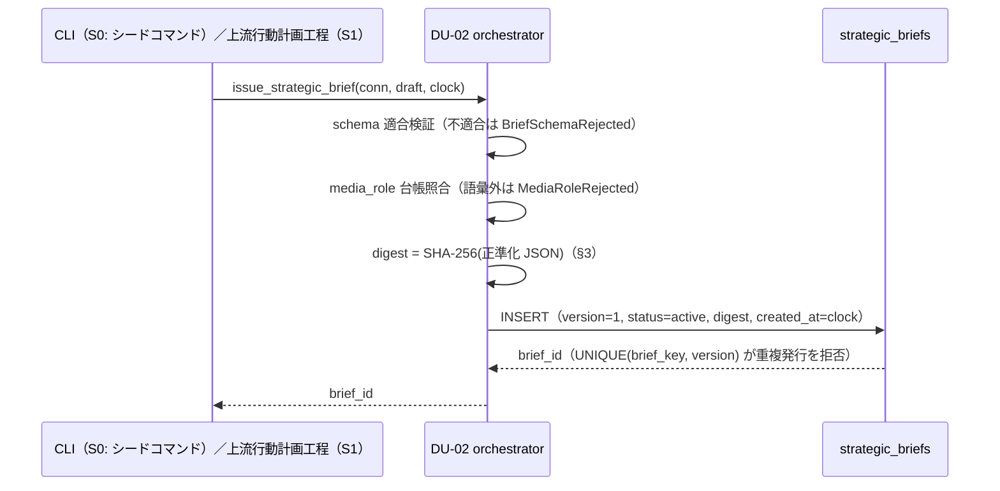

# 機能別詳細設計 — strategic_brief の発行・失効・検証

> status: **draft（再降下中）**（2026-08-01 全層再降下 §7 — AI 起草）
> 正準参照: 発注契約の正準は
> [strategy-learning-contract_v0.1.md §1](../../L3-system-requirements/canonical/strategy/strategy-learning-contract_v0.1.md)
> （§1.2bis = digest 算出規則）、DDL・保護トリガは
> [s0-contract_v0.1.md §2](../../L3-system-requirements/canonical/s0-contract_v0.1.md)、schema は
> [json/strategy/strategic-brief.schema.json](../../L3-system-requirements/canonical/schemas/strategy/strategic-brief.schema.json)。
> API 署名の正本は [detailed-design_v0.1.md DU-02](../../L5-detailed-design/canonical/detailed-design_v0.1.md)。本書は
> digest 正準化の実装手順・3 API のシーケンス・開始ガード・シード投入だけを確定する。

---

## 1. 目的

上流→下流の唯一の発注物 strategic_brief を、(a) 内容から決定的に計算される digest で同一性検証可能に、
(b) supersedes 連鎖のみで改訂可能に、(c) 有効な brief なしの下流開始を構造的に不可能に実装する。

## 2. 契約（実装が守る事前・事後・不変条件）

- **pre**: 発行入力は schema 適合（strategic_choice_id → segment_context_id → value_hypothesis_id の
  trace・desired_recognition_change・計測計画を必須）。media_role は media-roles.json の語彙。
- **post**: 同一内容からの digest 再計算は常に同一値（決定性 — AC-SR-01）。新版発行後、旧版は
  superseded・新規 run は新版のみ参照・実行中 run は旧 digest のまま完走（AC-SR-06-2）。
- **invariant**: 内容列の UPDATE・全行 DELETE は DB トリガが常時拒否。書込み API は
  `issue_strategic_brief`／`supersede_strategic_brief` の 2 本のみで、下流実行経路・コネクタ層へ
  公開しない（AC-SR-04・STC-I-06）。
- 検証オラクル群: STC-I-01/03/04・STC-G-01〜03/14/15・AC-SR-01/02/06/07/11/14 系（末尾 trace 表）。

## 3. digest 正準化（決定的アルゴリズム）

`digest = SHA-256(canonicalize(brief_content))` を発行時に 1 回計算し、以後は再計算照合のみ行う。

1. **対象の限定**: brief の内容フィールドのみを対象とし、`digest`・`status`・`created_at` を
   算出対象から**除外**する（status 遷移・記録時刻で digest が変わらない）。
2. **Unicode 正規化**: すべての文字列値とキーを NFC へ正規化する（結合文字差を吸収）。
3. **正準 JSON 直列化**: キー昇順ソート・区切り `(",", ":")`（空白なし）・`ensure_ascii=False`。
   ネスト object も再帰的にキー昇順、配列は**順序維持**（prohibited_patterns 等の順序は意味を持つ）。
4. **エンコード**: UTF-8 バイト列にして SHA-256 → 64 桁小文字 hex。
5. キー順・空白・改行の差では digest は変化しない。内容 1 文字の差では必ず変化する
   （STC-I-04 が同一入力 2 回計算＋非対象列変更の不変を検証）。

正準化関数は DU-02 内の純関数として実装し、Clock・Rng・DB に依存しない
（同一入力 → 同一出力の単体検証を可能にする）。

## 4. 3 API のシーケンス

### 4.1 issue_strategic_brief（発行）

### 4.2 supersede_strategic_brief（新版発行 = 失効）

新版 INSERT と旧版 status 遷移を**単一 transaction** で行う（中間状態「active 2 本」「active 0 本」を
外部に見せない）。

1. `BEGIN IMMEDIATE`。
2. 旧版行を読込み、`version + 1`・`supersedes_id = old_brief_id` で新 draft の digest を計算して INSERT。
3. 旧版 `status = superseded` へ UPDATE（内容列は触らない — トリガの WHEN 境界内）。
4. COMMIT。失敗時は全 rollback（新版だけ・失効だけの片肺を残さない）。

旧版に紐づく実行中 run は完走を許す（run 保持 digest は旧版と一致し続けるため検証は通る）。
新規 run の開始時点で active なのは新版のみ。

### 4.3 validate_strategic_brief（検証 = 下流開始ガードの実体）

`(brief_id, held_digest)` を受け、次の 4 検査すべての成立で `ValidBrief` を返す。
1 つでも欠ければ `GateRejected`（状態・DB 不変）:

| 検査 | 拒否事由 |
|---|---|
| 行の実在 | brief なし（NULL 参照） |
| `status = active` | draft／superseded／retired |
| `digest = held_digest` | digest 不一致（内容すり替え・別版参照） |
| `valid_from <= now <= valid_until`（NULL は無期限、境界は有効） | 有効期間外 |

## 5. 下流開始ガードへの接続

- DU-01 の start ガード G3（[state-machine-design_v0.1.md §2](../../L4-basic-design/canonical/state-machine/state-machine-design_v0.1.md)）が
  `loop_kind = 'lower'` に限り §4.3 を呼ぶ。成立時のみ `loop_runs.strategic_brief_id`・
  `strategic_brief_digest` を run 行へ固定保存する（以後の TLP 整合の照合原本 —
  [tlp.md](tlp.md)）。
- DDL の CHECK（lower は brief_id/digest 非 NULL）が最終防衛。ガード拒否は
  `state_transitions` に guard_result = rejected で記録される（AC-SR-02）。

## 6. S0 シード投入

- S0 では上流生成系が未実装のため、brief は**シードコマンド**（CLI → `issue_strategic_brief`）で投入する
  （strategic_choice 等の上流モデル ID は json/strategy/ 上の ID 参照 — schema 適合は投入時に検証）。
- シードも本 API 経由のみとし、SQL 直 INSERT のシードスクリプトは作らない（digest 計算・schema 検証の
  バイパス経路を残さない）。
- 再実行は `UNIQUE(brief_key, version)` で冪等（既存版と同一 key/version の再投入は拒否 → 既存を返す）。

## 7. trace 表

| 設計要素 | DU | AC | TCC／STC |
|---|---|---|---|
| digest 正準化・決定性 | DU-02 | AC-SR-01 | STC-I-01（AC 側 tc 表記。pytest 実体は STC-I-04）, TCC-SR-01 |
| issue（schema・media_role 検証） | DU-02 | AC-SR-06-1, AC-SR-14-1, AC-SR-14-2, AC-SR-14-3 | TCC-SR-06-1, TCC-SR-14-1〜3, STC-G-01/02/14/15 |
| supersede（単一 tx・旧版遷移） | DU-02 | AC-SR-06-2, AC-SR-11-1, AC-SR-11-2 | TCC-SR-06-2, TCC-SR-11-1, TCC-SR-11-2, STC-I-04 |
| validate＋下流開始ガード | DU-01, DU-02 | AC-SR-02, AC-SR-07-1, AC-SR-07-2, AC-11-1 | STC-I-02（AC 側 tc 表記。pytest 実体は STC-I-03）, TCC-SR-02, TCC-SR-07-1, TCC-SR-07-2, TCC-11-1 |
| 直接変更不可（2 API 限定） | DU-02, DU-10 | AC-SR-04, AC-SR-05 | TCC-SR-04, TCC-SR-05, STC-I-01, STC-I-06, STC-G-10 |
| S0 シード投入 | DU-02 | AC-SR-15-1 | TCC-SR-15-1 |
