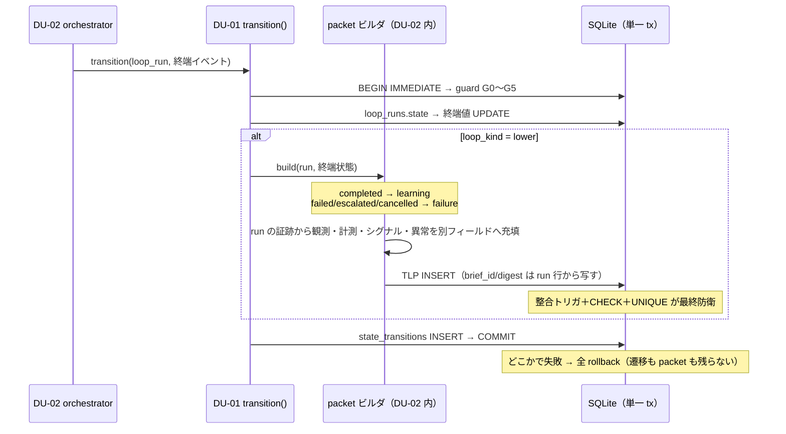

# 機能別詳細設計 — tactical_learning_packet（学習／失敗 packet）

> status: **draft（再降下中）**（2026-08-01 全層再降下 §7 — AI 起草）
> 正準参照: 還流契約の正準は
> [strategy-learning-contract_v0.1.md §2](../../L3-system-requirements/canonical/strategy/strategy-learning-contract_v0.1.md)、
> DDL・CHECK・整合トリガは [s0-contract_v0.1.md §2](../../L3-system-requirements/canonical/s0-contract_v0.1.md)、
> 終端処理の同一 transaction 契約は
> [state-machine-design_v0.1.md §6](../../L4-basic-design/canonical/state-machine/state-machine-design_v0.1.md)。API 署名の正本は
> [detailed-design_v0.1.md DU-02](../../L5-detailed-design/canonical/detailed-design_v0.1.md)。本書は DDL・トリガ本文を再掲しない —
> 生成の実装分岐と防御の役割分担だけを確定する。

---

## 1. 目的

下流→上流の唯一の還流物 TLP を「全終端 lower run にちょうど 1 件」で成立させる。
「終端したのに packet がない」「観測が成立しなかった run に因果解釈が捏造される」の 2 縮退を、
kernel の同一 tx 契約・DDL CHECK/トリガ・孤児検査の三重防御で塞ぐ。

## 2. 契約（実装が守る事前・事後・不変条件）

- **pre**: 対象 run は `loop_kind = 'lower'` かつ終端遷移中（completed／failed／escalated／cancelled）。
  packet の brief_id/digest は run 保持値の**写し**であり、呼出し側が別値を渡す経路を作らない。
- **post**: 終端遷移コミット後、TLP がちょうど 1 件存在する。completed → `packet_kind = 'learning'`、
  それ以外 → `'failure'`。
- **invariant**: TLP は append-only（提出のみ・撤回不可）。upper／micro の終端に TLP は生成しない。
  TLP 提出で strategic_briefs は 1 バイトも変わらない（推奨は入力であり決定ではない — AC-SR-09-2）。
- 検証オラクル群: STC-I-02/05/06・STC-G-08〜10・AC-SR-03/06/08/09 系（末尾 trace 表）。

## 3. 生成の同一 transaction 契約（実装分岐）

DU-01 の終端遷移 tx 内で DU-02 `generate_tactical_learning_packet` を呼ぶ。分岐は終端状態のみで決まる:

- ビルダは run の evidence・measurements 参照から `observations_json`（事実のみ）・`metrics_json`
  （KPI ノード参照）・`qualitative_signals_json`・`anomalies_json` を**別フィールドで**構成する。
  観測フィールドへ解釈文を入れる充填は組立時に拒否する（SR-02 の分離をビルダでも守る）。
- `evidence_ids_json` は run の実在 evidence ID のみ（空の learning packet は組立時拒否 — 観測なしに
  学習は還流できない）。

## 4. packet_kind の二分と因果解釈捏造の禁止

| kind | 生成条件 | 必須（DDL CHECK） | 持てない |
|---|---|---|---|
| learning | run = completed | causal_interpretation・hypothesis_result・assessment_reason | — |
| failure | run = failed／escalated／cancelled | failure_fact・reproduction_conditions・recovery_conditions | **causal_interpretation（NULL 強制）** |

- failure packet は「何が起き、どう再現し、何が揃えば回復するか」の**事実のみ**を還流する。
  観測が成立しなかった run へ市場因果の解釈を書く経路は、ビルダの型（FailureTlpDraft に
  causal_interpretation フィールドが存在しない）と DDL CHECK の二層で存在しない。
  混入は IntegrityError → tx 全体 rollback（終端遷移ごと不成立 — AC-SR-08-1）。
- hypothesis_result（supported／weakened／rejected／inconclusive）は learning のみ。判定不能は
  inconclusive を明示し、無記入で通さない。

## 5. 整合トリガと UNIQUE（最大 1 件・三者一致の DB 防衛）

DDL（正準 = s0-contract §2）が INSERT 時に強制する 4 条件を、実装は**前提として再実装しない**
（ビルダは正しい値を渡すだけ。二重に緩い検査を書いて DB 拒否をマスクしない）:

1. run は `loop_kind = 'lower'`（upper/micro への INSERT は ABORT）。
2. run は終端状態（走行中 run への先行提出は ABORT）。
3. `TLP.brief_id = run.brief_id` かつ `TLP.digest = run.digest = brief.digest`（三者一致）。
4. `UNIQUE(loop_run_id)` — 1 run 1 packet（二重提出は 2 件目が拒否）。

トリガ拒否は IntegrityError としてストア層境界で意味例外へ正規化し
（[error-taxonomy_v0.1.md §5](../../L5-detailed-design/canonical/errors/error-taxonomy_v0.1.md)）、同一 tx 内のため終端遷移ごと rollback する。

## 6. 孤児検査（最低 1 件の事後防衛 — DU-11 verify()）

- kernel 契約（§3）をすり抜けた「packet を持たない終端 lower run」を、DU-11 `verify()` の
  read-only SQL（terminal lower run LEFT JOIN TLP → NULL 行 = 0 件）で検出する。
  実行タイミングは起動時・migration 昇格時・LP-OPS ヘルスチェック
  （[migration.md](migration.md) §5）。
- 検出時は**自動修復しない**: 事後に packet を捏造すれば「終端時点の観測」という意味が壊れるため、
  `FatalError` → escalate（人の関与）で fail-close する。

## 7. trace 表

| 設計要素 | DU | AC | TCC／STC |
|---|---|---|---|
| 同一 tx 生成（completed=learning／他=failure） | DU-01, DU-02 | AC-SR-03, AC-SR-08-2 | STC-I-05, TCC-SR-03, TCC-KILL-2, TCC-SR-08-2 |
| packet_kind CHECK・因果解釈捏造禁止 | DU-02（＋DDL） | AC-SR-08-1 | TCC-SR-08-1 |
| 整合トリガ（lower・終端・三者一致・UNIQUE） | DU-10/11（DDL 適用）, DU-02 | AC-SR-06, AC-SR-01-2 | STC-I-06, TCC-SR-06, TCC-CONFLICT-2, TCC-SR-01-2 |
| append-only（提出のみ・撤回不可） | DU-10/11 | AC-SR-05, AC-SR-09-1, AC-SR-09-2 | STC-I-02, TCC-SR-05, TCC-SR-09-1, TCC-SR-09-2, STC-G-10 |
| 孤児検査（packet なし終端 lower run = 0） | DU-11 | AC-SR-03, AC-71-1 | STC-I-05, TCC-71-1 |
| 観測・解釈・判定・推奨の分離充填 | DU-02 | AC-SR-02-3 | STC-I-05, TCC-SR-02-3, STC-G-08/09 |
