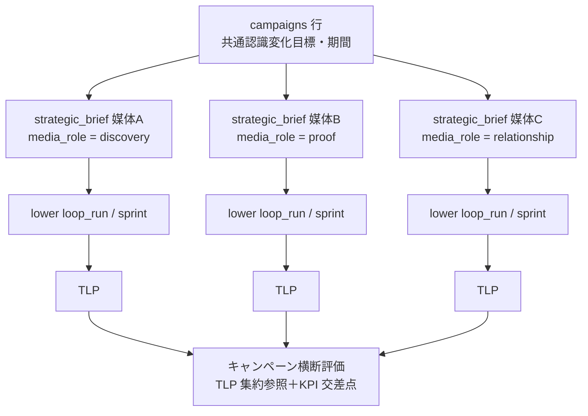

# 機能設計: 複数媒体キャンペーン（BR-I5・S1+）

> status: **planned**（2026-08-01 全層再降下 §7 — AI 起草。構造分類是正で S1 へ再配置）
> 正準参照: 要求 = BR-I5（[br-contracts.json](../../L1-business-requirements/canonical/br/br-contracts.json)）・REQ-050・
> SR-06/SR-14（[sr-contracts.json](../../L3-system-requirements/canonical/strategy/sr-contracts.json)）。
> 役割語彙 = [media-roles.json](../../L3-system-requirements/canonical/strategy/media-roles.json)（12 役割台帳）。
> スキーマ = [s0-contract_v0.1.md §2](../../L3-system-requirements/canonical/s0-contract_v0.1.md)（`strategic_briefs`・`sprints`・`tactical_learning_packets` — DDL 再掲禁止）。
> 上位設計: [strategy-loop-design_v0.1.md](../../L4-basic-design/canonical/components/strategy-loop-design_v0.1.md)（brief 発注経路）／[basic-design_v0.1.md](../../L4-basic-design/canonical/basic-design_v0.1.md)
> 位置づけ: 単発投稿の集合ではなく「同一の認識変化目標を媒体役割の組で追う期間キャンペーン」を
> 計画・実行・評価の単位として扱う実装計画。**S0 非対象（単媒体回転）— 本書は S1 実装の設計正本。**

---

## §0 位置づけ・動機

媒体別スプリントだけでは媒体間の連携（例: X で discovery → ブログで problem-framing／proof →
メールで relationship）が設計単位として存在せず、露出が点在する（BR-I5 problem）。キャンペーンは
「複数 brief を 1 つの共通認識変化目標で束ねる計画行」であり、束ねの宣言・発注・横断評価を
1 つの戦略実験として計測・学習できるようにする。

### S0 非対象の明示

- S0 は単媒体回転（WP ブログのみ）であり、キャンペーン計画行・横断評価・TLP 集約参照は
  **実装しない**（BR-I5 scope_out）。S0 の DDL にキャンペーンテーブルは存在せず、S1 の expand
  migration で追加する（rename・意味変更なし — FR-72）。
- S0 で既に成立している構造（strategic_brief の media_role 台帳検証 = SR-14、brief 経由の下流
  発注 = SR-06/07）はキャンペーンの前提部品であり、S1 は**その上に束ねの層を足すだけ**とする。

## §1 ドメインモデル（S1 expand）

### §1.1 キャンペーン計画行（campaigns — S1 expand テーブル）

列設計の要点（DDL は S1 migration が正準になる。ここでは契約のみ）:

| 列 | 契約 |
|---|---|
| business_profile_id | 直接スコープ列（ブランド隔離 — [brand-isolation-completion.md](brand-isolation-completion.md) の直接帰属方式に従う） |
| campaign_key・version | UNIQUE(campaign_key, version)。改訂は brief と同じく supersedes による新版 INSERT（append-only 側へ倒す） |
| desired_recognition_change | **共通認識変化目標**（キャンペーンの束ねの根拠。空は発行拒否） |
| period_start・period_end | キャンペーン期間。構成 brief の valid_from/valid_until はこの期間に包含される |
| media_plan_json | 対象媒体 × media_role 宣言の配列 `[{medium, media_role}]`。**role は media-roles.json の 12 語彙のみ**（SR-14 — 台帳外・媒体名の役割宣言は発行拒否）。役割宣言なしの媒体束ねは schema レベルで不可（BR-I5 prohibition） |
| status | draft → active → completed／cancelled（評価成立で completed — §3） |

### §1.2 brief 経由発注（BR-I2 の維持）

- キャンペーンは**下流を直接発注しない**。campaigns 行の確定（人間の企画確定 — BR-H1/BR-I5
  human_judgement）後、媒体ごとに strategic_brief を発行し、`strategic_briefs` に S1 expand で
  追加する `campaign_id`（NULL 許容 FK）で束ねる。
- 下流 lower run の開始条件は S0 と不変（有効 brief の id＋digest — s0-contract §3.1）。
  キャンペーン所属は開始ガードに**追加条件を足さない**（brief が唯一の発注契約 — 束ねは評価側の
  概念であり実行側の概念ではない）。
- 各 brief の `desired_recognition_change` はキャンペーンの共通目標を継承しつつ媒体役割ごとの
  表現を持てる。継承整合（campaign の目標と brief の目標の対応）は発行時検証で warn、
  乖離の解釈は上流改善工程の領分とする。

## §2 発行検証（S1 の brief 発行パイプライン拡張）

`issue_campaign(scope, draft)` の検証順（すべて fail-close・1 発行 = 1 transaction）:

1. schema 検証（campaign schema — json/strategy/ へ S1 で追加）。
2. media_plan_json の各 role を media-roles.json 台帳と照合（SR-14 と同一の照合器を再利用 —
   台帳欠損・空・パース不能は全拒否）。同一媒体の重複宣言は拒否。
3. 期間整合（period_end >= period_start、構成 brief の有効期間包含）。
4. 共通認識変化目標の実質性（空文字・空白のみは拒否）。
5. INSERT（version・status = draft）。active 化は構成 brief が 1 件以上発行された時点。

拒否は `CampaignSchemaRejected`／`MediaRoleRejected`（既存 G-MEDIA-ROLE 語彙）で operation_log
証跡へ記録する。

## §3 媒体横断評価

- **評価単位**: キャンペーン期間終了（又は明示のレビュー要求）で、構成 brief 配下の全 TLP を
  `campaign_id → briefs → loop_runs → TLP` の FK チェーンで**集約参照**する（BR-I5 scope_in）。
  集約は読取りビューであり、TLP の再書込み・合成 TLP の自動生成はしない（TLP は run 単位
  append-only — 不変）。
- **単純合算のみの評価は禁止**（BR-I5 prohibition）: 横断評価の出力は「媒体別数値の合算表」では
  なく、(a) 役割ごとの仮説判定（各 TLP の hypothesis_result の並置）、(b) 媒体間の送客・参照
  関係の観測（KPI 交差点 — [kpi-handoff.md](../S0/kpi-handoff.md) の観測背骨を campaign 断面で読む）、
  (c) 共通認識変化目標に対する評価レビュー、の 3 部構成とする。
- **評価もレビュー証跡**: 横断評価は T-REVIEW 系 task として実行し、review 証跡（BR-I5
  completion_evidence「横断評価のレビュー証跡」）を evidence に残した場合のみ campaign を
  completed へ遷移させる。評価から上流への還流は通常どおり TLP／revision 経路のみ
  （キャンペーンから戦略正本への自動書込み経路は作らない — SR-12 と同じ分離）。

## §4 S1 実装計画

| 順 | 作業 | 完了証跡 |
|---|---|---|
| 1 | campaign schema（json/strategy/）＋ campaigns テーブル・`strategic_briefs.campaign_id` の expand migration | 空 DB／既存 DB 双方の migration 検証（s0-contract §5.2） |
| 2 | `issue_campaign` 発行検証（§2）— SR-14 照合器の再利用 | 発行受理・台帳外拒否・重複媒体拒否の pytest green |
| 3 | brief 発行への campaign_id 束ね＋期間包含検証 | 束ね付き brief 発行と lower run 開始（S0 ガード不変）の回帰 green |
| 4 | TLP 集約参照ビュー＋横断評価 task（T-REVIEW 系 WF） | キャンペーン計画行と媒体役割宣言・横断評価のレビュー証跡（BR-I5 completion_evidence） |
| 5 | ブランド隔離との交差（campaigns のスコープ強制） | 越境 negative test への campaign ケース追加 |

規律: test-first（⑥改訂で campaign 系 TC を採番してから実装）。S0 構造の変更ゼロ
（既存テーブルへの変更は campaign_id の expand 追加のみ・NULL 許容で後方互換）。

## §5 trace 表

キャンペーンは S1+ のため S0 の TC カタログ（TCC）に割当がない。S1 の⑥改訂で TC を採番し
本表を更新する（ラチェット — 分母の縮小なし）。

| 実装単位 | DU | AC | TCC | 備考 |
|---|---|---|---|---|
| campaigns テーブル・expand migration | DU-11（migrate）＋ S1 採番 DU | —（S1 採番） | —（S1 採番） | FR-72 規律に従う |
| issue_campaign 発行検証・役割台帳照合 | S1 採番 DU（SR-14 照合器は brief 発行と共用） | AC-SR-01（brief 発行決定性の準用） | STC-I-04（準用） | MediaRoleRejected は既存 G-MEDIA-ROLE |
| brief 束ね発注（campaign_id） | DU-02（issue_strategic_brief 拡張） | AC-SR-01・AC-SR-02 | STC-I-03・STC-I-04 | lower run 開始ガードは S0 と不変 |
| TLP 集約参照・横断評価 | DU-02（TLP 読取り）＋ S1 採番 DU | AC-SR-03（TLP 生成の前提） | STC-I-05（前提） | 合算のみ評価の禁止を review チェック項目化 |
| ブランド隔離交差 | [brand-isolation-completion.md](brand-isolation-completion.md) §3 に追従 | AC-34-2（準用） | TCC-34-2（準用） | campaigns は直接スコープ列 |
