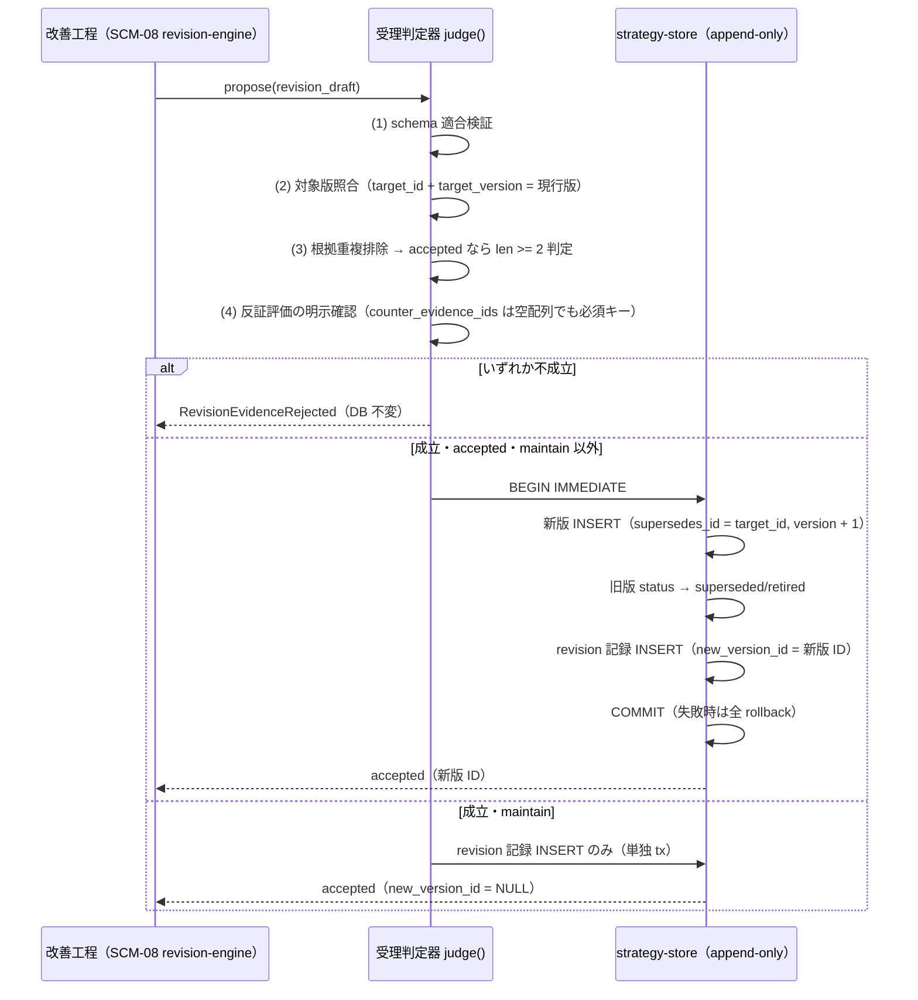

# 機能別詳細設計 — 上流戦略改訂（strategy_revision）

> status: **planned**（2026-08-01 全層再降下 §7 — AI 起草。構造分類是正で S1 へ再配置）
> 正準参照: 改訂契約の正準は
> [strategy-learning-contract_v0.1.md §3](../../L3-system-requirements/canonical/strategy/strategy-learning-contract_v0.1.md)、
> フィールド正準は [json/strategy/strategy-revision.schema.json](../../L3-system-requirements/canonical/schemas/strategy/strategy-revision.schema.json)、
> 上位要件は [strategy-loop-requirements_v0.1.md](../../L3-system-requirements/canonical/strategy/strategy-loop-requirements_v0.1.md)
> （SR-10/11/16）。上位設計は [strategy-loop-design_v0.1.md](../../L4-basic-design/canonical/components/strategy-loop-design_v0.1.md)（SCM-08）。
> 本書は契約を再定義しない — 受理判定の実装アルゴリズムと transaction 境界だけを確定する。

---

## 1. 目的

上流改善工程の出力 `strategy_revision` を、「根拠と反証を持った版更新の唯一の手続き」として実装する。
単一 KPI 変動での自動書換え・根拠の水増し・「見ていないのに維持扱い」の 3 縮退を、
schema・受理判定器・DB トリガの三層で構造的に不可能にする。

## 2. 契約（実装が守る事前・事後・不変条件）

- **pre**: revision は schema 適合（target_type・target_id・target_version・revision_type・reason・
  supporting_evidence_ids・counter_evidence_ids・confidence・status 必須）。対象正本の
  `target_version` が現行 active 版と一致している（版を特定しない revision は無効）。
- **post（accepted かつ revision_type != maintain）**: 新版行（`supersedes_id = target_id`）・
  旧版 status 遷移（active → superseded／retired）・revision 記録の 3 書込みが**単一 transaction** で
  すべて成立するか、すべて成立しない。
- **post（maintain）**: 新版は生成されず（`new_version_id` は NULL）、revision 記録のみが残る —
  「見て維持した」が機械可読になる。
- **invariant**: 上流正本の内容列は UPDATE されない（append-only トリガ —
  [db-design_v0.1.md §3](../../L4-basic-design/canonical/data/db-design_v0.1.md)）。accepted の支持根拠は重複排除後 2 件以上。
- 検証オラクル群: STC-G-11/12・STC-I-07（S1）・AC-SR-10／AC-SR-11／AC-SR-16 系（末尾 trace 表）。

## 3. 受理判定シーケンス

判定は決定的な直列 5 段で行い、どの段で落ちても DB を変更しない
（`RevisionEvidenceRejected` — [error-taxonomy_v0.1.md §3.5](../../L5-detailed-design/canonical/errors/error-taxonomy_v0.1.md)）。

## 4. 根拠の重複排除（2 件判定の前処理）

`supporting_evidence_ids` は schema の `uniqueItems` に加え、受理判定器が**正規化後の同一性**で
重複を排除してから件数を数える。

1. 各 ID を trim → NFC 正規化 → prefix 種別（EV-／OBS-／TLP-／SREV-／URL／file:）ごとの正規形へ変換
   （URL は末尾スラッシュ・フラグメントを落とす）。
2. 正規化後に一致する ID は 1 件として数える。**同一 TLP の再掲・同一計測の別表記で 2 件扱いしない**。
3. 排除後 `len < 2` の accepted 要求は `RevisionEvidenceRejected`（単一根拠 accept の拒否 — SR-10）。
4. `counter_evidence_ids` にも同じ正規化を適用し、支持と反証の両方に同じ ID が現れた場合は
   矛盾として拒否する（判定不能を通さない — fail-close）。

## 5. maintain の明示記録と一周判定（SR-16）

- `revision_type = maintain` は new_version_id なしの正規の revision であり、記録を省略しない。
  「見ていない」（revision 行なし）と「見て維持した」（maintain 行あり）を後から区別できる。
- 一周カウンタは「strategy_revision を経て意味モデルのいずれかが**更新**されたとき」だけ +1 する:
  maintain のみの回転は False、同一回転で複数モデルが更新されても 1 回、記録欠損は判定不能として
  一周にしない側へ倒す（AC-SR-16-3）。判定入力は revision 記録のみ — KPI 変動・TLP 件数からは計上しない。

## 6. S1 実装計画

S0 は schema 確定と docs ゲート（G-REVISION-EVIDENCE の fixture negative test）まで
（[strategy-loop-design_v0.1.md §3](../../L4-basic-design/canonical/components/strategy-loop-design_v0.1.md)）。S1 の実装順:

1. **strategy-store 拡張**（SCM-01）: 意味モデル 12 種の版付き永続化（strategic_briefs と同型の
   append-only 規約・保護トリガを expand migration で追加 — [migration.md](../S0/migration.md) の規律に従う）。
2. **judge() 実装**（SCM-08）: 本書 §3〜§4 のアルゴリズム。`RevisionEvidenceRejected` は
   GateRejected 系（状態不変）として実装し、STC-I-07 を test-first で赤 → green。
3. **TLP 集約 → 提案生成**（SCM-08）: `get_tactical_learning_packet`（DU-02）を唯一の還流読取り口
   として複数 TLP・時間差・反証を集約し revision 案を生成。**提案生成と受理判定は別工程**
   （生成器は accepted を書けない）。
4. **affected_brief_ids の下り接続**: accepted 時に brief 再発行対象を列挙し、
   [strategic-brief.md](../S0/strategic-brief.md) の supersede API へ引き渡す（自動発行はしない —
   行動計画工程の判断を挟む）。

## 7. trace 表

| 設計要素 | DU／SCM | AC | TCC／STC |
|---|---|---|---|
| 受理判定（根拠 2 件・反証明示） | SCM-08（S1） | AC-SR-10-2, AC-SR-12-2 | TCC-SR-10-2, TCC-SR-12-2, STC-G-11/12, STC-I-07 |
| 原子的新版生成（単一 tx） | SCM-08＋SCM-01（S1） | AC-SR-10-1 | TCC-SR-10-1 |
| 根拠重複排除・最低境界 | SCM-08（S1） | AC-SR-10-3 | TCC-SR-10-3 |
| maintain の明示記録 | SCM-08（S1） | AC-SR-10-3, AC-SR-16-3 | TCC-SR-10-3, TCC-SR-16-3 |
| append-only 版管理（内容列凍結） | DU-10/11（S0 DDL）＋SCM-01 | AC-SR-11-1, AC-SR-11-2, AC-SR-05 | TCC-SR-11-1, TCC-SR-11-2, TCC-SR-05, STC-I-01 |
| 一周判定 | SCM-08（S1） | AC-SR-16-1, AC-SR-16-2, AC-SR-16-3 | TCC-SR-16-1, TCC-SR-16-2, TCC-SR-16-3, STC-I-10 |
