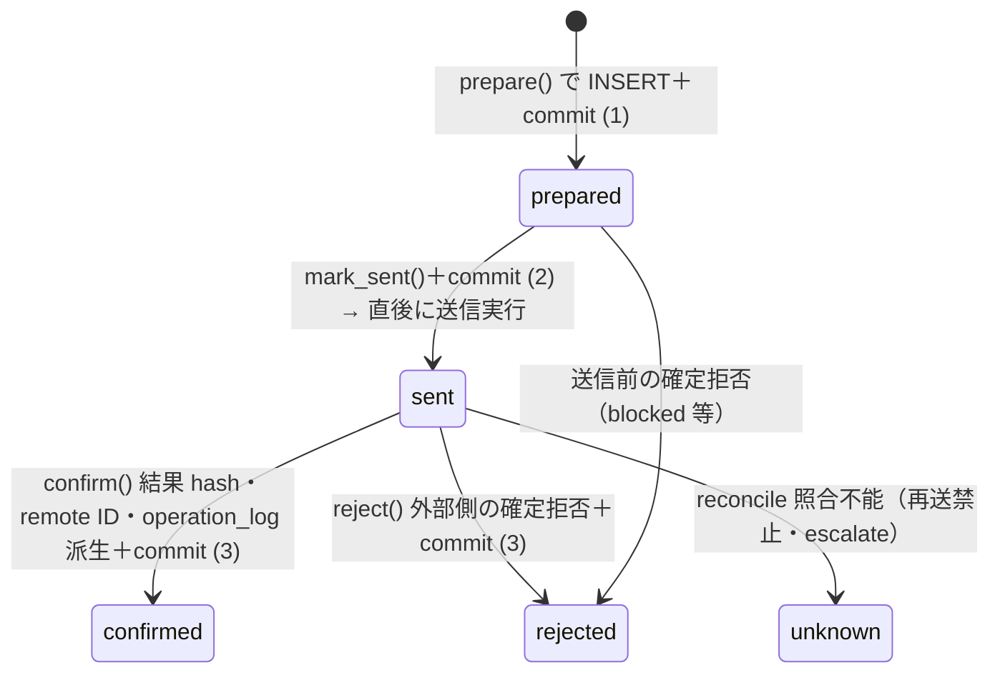

# 機能設計: 外部操作（external_operations ライフサイクル・冪等・レート節度）

> status: **draft（再降下中）**（2026-08-01 全層再降下 §7 — AI 起草）
> 上位設計: [external-if-design_v0.1.md](../external-if-design_v0.1.md)（コネクタ境界契約 — intent/結果/エラー型・写像表は同書が正本。本書は再掲しない）
> 正準参照: 要求 = BR-I7・BR-F5（[br-contracts.json](../../requirements/json/br/br-contracts.json)）・FR-44/42・NFR-3/7。
> スキーマ・遷移 = [s0-contract_v0.1.md](../../requirements/s0-contract_v0.1.md) §1（external_operations 遷移順序）・§3.3（再開規則）・§6（環境契約 — DDL 再掲禁止）。
> 兄弟文書: [error-taxonomy_v0.1.md](../error-taxonomy_v0.1.md)／[approval.md](approval.md)
> 位置づけ: 外部書込み 1 操作の一生（prepared→sent→confirmed/rejected/unknown）を、関数分解・
> 冪等キー生成・再開照合・レート節度の実装レベルまで降下させる。

---

## §0 位置づけ・動機

無人運転はクラッシュ・中断・再実行が常態であり（BR-I7 problem）、外部書込みは「二重公開しない」
「送信直後に死んでも SQLite だけから安全に再開できる」ことを操作単位で保証しなければならない。
本書は s0-contract の契約を実装の関数列（コミット点・kill point・照合手順）に落とす。

## §1 責務分離

| 実装単位 | 所属 | 責務 | 失敗方針 |
|---|---|---|---|
| `ExternalOpRecorder` | `connectors/_extops.py`（コネクタ共通副層） | external_operations 行の INSERT／status 遷移／operation_log 証跡派生の唯一の書き手 | 遷移順序外の UPDATE は実装例外（契約違反 = バグ） |
| `make_idempotency_key(...)` | 同上（純関数） | 決定的な冪等キー生成（§3） | 入力欠落は生成拒否（キーなし書込みの経路を残さない — BR-I7 prohibition） |
| `RatePacer` | `connectors/_rate.py` | 書込み間隔の一様乱数待機・日次 cap・バースト待機（§5） | 上限超過は実行前拒否（fail-close） |
| `reconcile_sent(op)` | `connectors/_extops.py` | 再起動時の sent 照合（§4）。confirmed 化・証跡補完・unknown 化 | 照合不能は unknown → escalate（再送 0 回） |
| 各コネクタ（DU-15〜17・22） | `connectors/*.py` | intent 実行の本体。Recorder／Pacer を経由してのみ外部送信 | 例外は ConnectorError へ境界正規化（外部 IF 設計 §3） |
| kill point ガード | `connectors/wp.py`（DU-17）ほか書込み系 | 送信先 allow-list 検証（Docker WP 限定 — §6） | ProductionWriteDenied で送信 0 回拒否 |

## §2 ライフサイクル実装（pending 相当 = prepared から）

1 外部書込み = external_operations 1 行。実装は次の関数列で、**コミット点を 3 つ**持つ。



| 段階 | 実装契約 |
|---|---|
| prepare | intent 検証（PairPass／ApprovalPass 等の前提 — 外部 IF 設計 §2）→ `make_idempotency_key` → 行 INSERT（status = prepared・request_hash = 正準化 request の SHA-256）→ **commit**。この時点で送信 0 回 |
| mark_sent | 送信の**直前**に status = sent・sent_at を UPDATE → **commit**。送信直後クラッシュの検出窓は「sent かつ confirmed_at NULL」（s0-contract §1） |
| 送信 | HTTP／ブラウザ操作の実行。timeout は config 宣言値（外部 IF 設計 §4）。送信後の例外は失敗扱いにせず reconcile へ |
| confirm／reject | 応答の結果確定 → response_hash・external_operation_id・remote_object_id を UPDATE、**operation_log 証跡を evidence へ派生**（evidence_id 相互参照）→ **commit**。**状態機械イベント（task の遷移）はこのコミットの後**（証跡が先、遷移が後 — NFR-3） |

- prepared→sent を送信前に分けてコミットするのは、クラッシュ位置を SQLite 状態だけで判別する
  ため（prepared = 未送信確定、sent = 送信したかもしれない）。この 2 コミットを 1 つに畳む
  「最適化」は契約違反。
- 下書き作成と公開は**別 idempotency key の別行**（AC-44-1）。1 行に複数操作を混載しない。

## §3 冪等キー生成

```python
def make_idempotency_key(task_id, service, operation, step_key, attempt) -> str:
    # 決定的: 同一 task の同一操作の再実行は同一 key
    return sha256_hex(f"{task_id}:{service}:{operation}:{step_key}:{attempt}")[:48]
```

- **決定性**: 乱数・時刻を含めない（Clock/Rng 注入対象外 — 再実行で同一 key を得ることが冪等の
  根拠。BR-I7「冪等キーによる二重実行検出」）。attempt を含めるため、verify_fail 差戻し後の
  正当な再制作は新 key = 新操作行になる。
- **UNIQUE 検出**: 同一 key の再 INSERT は `idempotency_key` UNIQUE で既存行に照合され、
  実装は例外を握って既存行の status に応じた §4 の分岐へ入る（AC-44-3 — 二重公開なし）。
- **key 非対応サービス**: WP は idempotency key を決定的 meta key（`_helix_idem_<key>`）として
  下書き・投稿へ保存し、送信前に同 meta の事前照合（既存 = 送信スキップ・confirmed 化）を行う
  （s0-contract §3.3）。照合手段が全滅なら fail-close。

## §4 sent 照合による再開（reconcile_sent）

再起動時（DU-02 の §3.3 再開規則から呼出し）、in-flight 行を status で分岐する:

| status | 照合手順 | 帰結 |
|---|---|---|
| prepared | 未送信確定。同一 key のまま送信続行可 | mark_sent → 送信（再送ではなく初送） |
| sent | リモート側を (a) external_operation_id、(b) remote_object_id、(c) idempotency key（WP meta／slug）の優先順で照合 | 成功確認 → confirm()＋証跡補完 → task を verifying へ。失敗確認 → reject()。**照合不能 → status = unknown・再送せず escalate**（最危険 kill point で再送 0 回 — s0-contract §8） |
| confirmed | 証跡補完のみ（operation_log／published_url の欠落分） | task を verifying へ |
| rejected／unknown | 終端。新しい操作行の明示発行までなにもしない | §3.2 の失敗分類に従う |

- 照合は**読取専用操作のみ**で行う（照合のために書込みを試さない）。
- 「成功したはず」という推測・プロセス内メモリの残骸を再開根拠にしない（s0-contract §3.3）。
- mock 媒体側の成功／失敗／照合不能 fixture で 3 分岐すべてをテストする（AC-42-3・AC-44-3）。

## §5 レート節度の実装（一様 1〜5 秒・seed 記録）

正準は外部 IF 設計 §7（NFR-7・BR-F5）。実装契約:

```python
class RatePacer:
    def __init__(self, rng: Rng, clock: Clock, config: ConfigStore): ...
    def before_write(self, service: str, media: str) -> None:
        # 1) 日次 cap 検査 → 超過は RateLimitExceeded（実行前拒否）
        # 2) バースト検査（wp: burst_per_min）→ 超過は待機
        # 3) interval = rng.uniform(config.rate_interval_min_sec,
        #                           config.rate_interval_max_sec)  # 暫定 1〜5 秒
        # 4) 構造化ログ: {seed, interval, service, media} を 100% 記録
        # 5) clock.sleep(interval)
```

- **対象は書込み・公開系のみ**。読取り系は Pacer を通さない（NFR-7 固定 — fetch_metrics 等は
  通常速度）。
- **Rng/Clock 注入**: seed は起動時に 1 回採番して構造化ログへ記録し、テストは seed 固定で
  間隔列を再現する（AC-42-1 — 決定性）。`time.sleep` 直呼びは禁止（Clock 経由 — テストで
  仮想時間化）。固定間隔（分散 0）は機械署名として禁止のため、min == max の config は起動時
  検証で拒否する。
- **cap の数え方**: 当日の confirmed＋sent 行数（プロファイル×媒体別）を external_operations
  から数える（メモリカウンタ禁止 — 再起動で失われない）。到達後の公開系は翌日まで waiting
  （loop_run の wait イベント）。11 件目の即時拒否は RateLimitExceeded → operation_log 記録
  （AC-42-2）。
- 値はすべて config 行（`config.rate_interval_min_sec`／`max_sec`／`rate.<media>.daily_write_cap`／
  `rate.wp.burst_per_min`）。ハードコード禁止・変更は config INSERT のみ。

## §6 Docker WP 限定の kill point

外部書込みの最終防波堤は**送信先 allow-list**（環境契約 = s0-contract §6）:

1. `connectors/wp.py`（DU-17）は送信直前（mark_sent の前）に target_endpoint を
   `config.wp.allowed_write_endpoints`（S0 = Docker WP の URL のみ）と突合し、
   一致しなければ `ProductionWriteDenied` — **送信 0 回・prepared 行は rejected 化**・
   operation_log に理由記録（AC-44-2）。
2. credential 側でも二重化: テスト credential × 本番 endpoint の組は接続前に
   CredentialEndpointMismatch で拒否（DU-14 — 外部 IF 設計 §6）。
3. 実 GA4 への**書込み操作はコード上存在しない**（fetch_metrics は read-only 契約 — DU-22 が
   read-only を型で保証し、書込み intent を受け取る API を持たない）。
4. dry-run は外部送信せず、予定 request fingerprint と mock operation ID を operation_log に
   残す（環境契約）。テスト・CI はこの allow-list を Docker／mock のみで構成する。

## §7 テスト方針（test-first）

- 純関数（make_idempotency_key・request_hash 正準化・Pacer の間隔算出）は fixture のみで検証。
- ライフサイクル・再開は in-memory SQLite ＋ mock transport で、**各コミット点直後の
  プロセス kill を模擬**（transaction を切って再開関数を呼ぶ）する 3 点 kill test を必須とする:
  prepared 直後／sent 直後（WP 成功済み・WP 失敗・照合不能の 3 変種）／confirmed 直後。
- 「外部送信回数」を mock transport のカウンタで assert し、拒否系・再開系はすべて送信 0 回
  又は 1 回（再送なし）を確認する（TCC の副作用列と同じ観点）。

## §8 trace 表

| 実装単位 | DU | AC | TCC | 備考 |
|---|---|---|---|---|
| ライフサイクル 3 コミット・operation_log 派生 | DU-17（wp）・DU-16（playbooks）・DU-09（evidence store） | AC-44-1 | TCC-44-1 | draft/publish は別 key 別行 |
| PairPass なし・本番 WP 拒否（kill point） | DU-17・DU-05（require_pair）・DU-14（endpoint 突合） | AC-44-2 | TCC-44-2 | 送信 0 回・ProductionWriteDenied |
| sent 照合再開・同一 key 冪等 | DU-02（§3.3 再開）・DU-17 | AC-44-3 | TCC-44-3 | 最危険 kill point で再送 0 回 |
| レート節度（間隔・seed 再現） | DU-15（browser）・DU-16 | AC-42-1 | TCC-42-1 | Rng/Clock 注入・構造化ログ 100% |
| 媒体禁止・日次 cap 拒否 | DU-15・DU-16 | AC-42-2 | TCC-42-2 | ProhibitedMediaWrite／RateLimitExceeded |
| ブラウザ経路の sent 照合・unknown escalate | DU-15・DU-02 | AC-42-3 | TCC-42-3 | 照合不能 = unknown・escalate |
| 計測取得の read-only 保証 | DU-22 | AC-62-1 | TCC-62-1 | 実 GA4 書込み経路の不在 |
